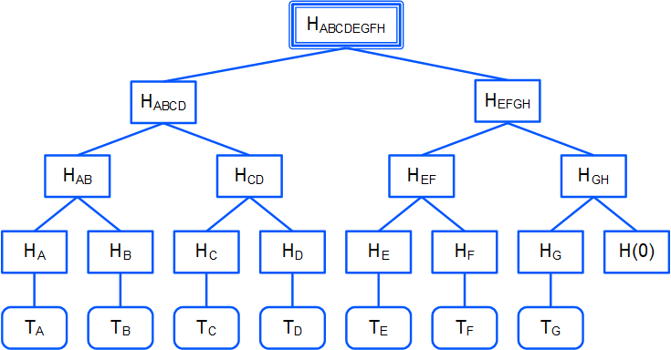
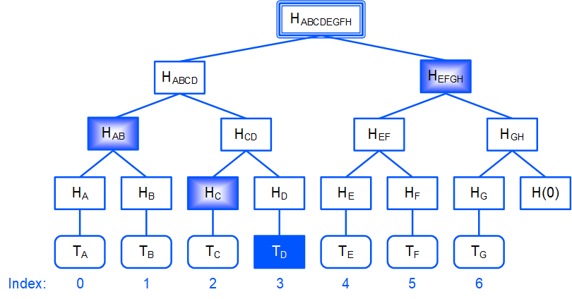

# Transactions Root Hash

The `transactionsRoot` field in the block header contains the root hash of the [Merkle tree](https://en.wikipedia.org/wiki/Merkle_tree) of transactions of the block. The root hash is the proof that the block contains all the transactions in the proper order.

The transactions root hash in the block header has the following purposes:

* To prove the integrity of transactions in the block without presenting all transactions.
* To sign the block header only, separately from its transactions.

> :warning: `transactionsRoot` is added since node version 1.2.0. This functionality is enabled by activating of feature #15 “Ride V4, VRF, Protobuf, Failed transactions”. Versions 1.2.x are currently available on [Stagenet](/en/blockchain/blockchain-network/stage-network) only.

## transactionsRoot Сalculation



1. The hash of each transaction in the block is calculated. For example:

   H<sub>A</sub> = hash(T<sub>A</sub>)

   H<sub>B</sub> = hash(T<sub>B</sub>)

   etc.

2. Each pair of adjacent hashes is concatenated, and the hash is calculated for each resulting concatenation:

   H<sub>AB</sub> = hash(H<sub>A</sub> + H<sub>B</sub>)

   If the last hash does not have a pair, it is concatenated with the zero byte hash:
   
   H<sub>GH</sub> = hash(H<sub>G</sub> + hash(0))

3. Step 2 is repeated until the root hash is obtained:

   H<sub>ABCDEFGH</sub>
   
   The root hash is written in the `transactionsRoot` field.

> If the block is empty, then `transactionsRoot` = hash(0).

Waves blockchain uses [BLAKE2b-256](https://en.wikipedia.org/wiki/BLAKE_%28hash_function%29) hashing function.

## Proof of Transaction in Block

Let's suppose that side&nbsp;1 stores the full blockchain data and side&nbsp;2 stores the block headers only.

To prove that the block contains a given transaction, side 1 provides the following data:

* `T`: Transaction to check.
* `merkleProofs`: Array of sibling hashes of the Merkle tree, bottom-to-top.
* `index`: Index of the transaction in the block.



For example, for the T<sub>D</sub> transaction:

* `merkleProofs` = [ H<sub>С</sub>, H<sub>AB</sub>, H<sub>EFGH</sub> ]
* `index` = 3

Side 2 checks the proof:

1. It calculates the hash of the transaction being checked (all the transaction data is hashed, including the signature):

   H<sub>D</sub> = hash(T<sub>D</sub>)

2. It concatenates the current hash with the corresponding hash of the `merkleProofs` array and calculates the hash of concatenation.

   `index` determines in which order to concatenate the hashes:
   
   * If the `n`th bit of `index` from the end is 0, then the order is: the current hash + the `n`th hash of the `merkleProofs`array (proof hash is on the right).
   * If the `n`th bit is 1, the order is: the `n`th hash of the `merkleProofs`array + the current hash (proof hash is on the left).

   For example, `index` = 3<sub>10</sub> = 11<sub>2</sub> , thus:
   
   * `merkleProofs`[0] = H<sub>С</sub> is on the left,
   * `merkleProofs`[1] = H<sub>AB</sub> is on the left,
   * `merkleProofs`[2] = H<sub>EFGH</sub> is on the right.

3. It repeates Step 2 until the root hash is obtained:

   H<sub>ABCDEFGH</sub>

4. It compares the root hash obtained with the already known `transactionsRoot` from the block header. If the hashes match, then the transaction exists in the block.

## Tools

The following Node API methods accept transaction IDs and provide the proof that the transaction is in a block for each transaction:

* `GET /transactions/merkleProof`
* `POST /transactions/merkleProof`

The methods are described in the [Transaction](/en/waves-node/node-api/transactions) article.

You can check a transaction on the same blockchain without using a root hash, since the Waves node stores the full blockchain data, including all transactions. Use the following built-in Ride function:

```
transactionHeightById(id: ByteVector): Int|Unit
```

The function returns the block height if the transaction with the specified `id` exists. Otherwise, it returns `unit`. See the function description in the [Blockchain functions](/en/ride/functions/built-in-functions/blockchain-functions#transactionheightbyid) article.

To check a transaction in a block on the external blockchain you can use the following built-in Ride function:

```
createMerkleRoot(merkleProofs: List[ByteVector], valueBytes: ByteVector, index: Int): ByteVector
```

This function is applicable if the external blockchain uses the same algorithm for calculating the root hash of transactions (for instance, external blockchain is Waves-based). The `createMerkleRoot` function calculates the root hash from the transaction hash and sibling hashes of the Merkle tree (see Steps 1–3). To check a transaction in a block, compare the calculated root hash with the `transactionsRoot` value in the block header. See the function description in the [Verification functions](/en/ride/functions/built-in-functions/verification-functions#createmerkleroothash) article.
