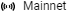
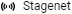
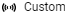

# Blockchain networks: Mainnet, Testnet, Stagenet

**Blockchain network** consists of [nodes](/en/blockchain/node/) interacting with each other.

The following blockchain networks are based on the Waves protocol:

* **Mainnet** is the core Waves network where cryptocurrencies possess real economic value and nodes that generate blocks are rewarded with native coins from the protocol and also the transaction fees paid by the participants.
* **Testnet** is the network for application testing. Testnet provides the same functionalities as Mainnet. However, on Testnet you can obtain WAVES tokens for free using [Faucet](https://wavesexplorer.com/testnet/faucet), so you can run in your project without risk of losing real money.
* **Stagenet** is the experimental network. Waves team tests protocol functionalities on Stagenet before they are deployed on Testnet and Mainnet, so you can try out the new features and give a feedback. If you want to launch a Stagenet node, get WAVES tokens on lease, ask a question or leave a comment, join the [stagenet](https://discord.gg/3g8XR6B) channel in Discord. Please note: experimental functionalities may work unstably and blockchain height rollbacks are possible.

Moreover, you can setup your own custom blockchain network based on WAVES protocol.

:warning: Note that blockchain data (accounts, transactions, tokens) are different in networks.

## Connecting Node to Blockchain Network

You can lunch your node in any blockchain network. Select the network using the `waves.blockchain.type` setting in the node configuration file.  For more information about the configuration file, see the [Node Configuration](/en/waves-node/node-configuration) article.

For installing a node, see the [Install Waves Node](/en/waves-node/how-to-install-a-node/how-to-install-a-node) article. For starting your own blockchain network, see the [Custom Blockchain](/en/waves-node/private-waves-network) article.

## Chain ID

Chain ID is a symbol that is passed over a network during a handshake and allows nodes not to connect to the nodes of other networks.

The chain ID is used while building account addresses, therefore, an address on one blockchain network cannot be used on another network. The chain ID is also indicated in transactions so it is impossible to move transactions between different blockchain networks.

| Blockchain Network | Chain ID |
| :--- | :--- |
| Mainnet | `W` or 87 (ASCII code of `W`) |
| Testnet | `T` or 84 (ASCII code of `T`) |
| Stagenet | `S` or 83 (ASCII code of `S`) |
| Custom | Symbol choosen by the network owner and specified in the `address-scheme-character` setting |

## Tools

The applications that make up the Waves ecosystem provide the ability to work with different blockchain networks.

### API of Pool of Public Nodes

For the convenience of users and developers who are not yet ready to launch their own node, the Waves team provides the pool of nodes with public API. You can use the API to read blockchain data and send transactions.

Addresses of the pool of public nodes are as follows:

| | |
| :--- | :--- |
| Mainnet | <https://nodes.wavesnodes.com/> |
| Testnet | <https://nodes-testnet.wavesnodes.com/> |
| Stagenet | <https://nodes-stagenet.wavesnodes.com/> |

### Waves.Exchange

[Waves.Exchange](https://docs.waves.exchange/en/) is a decentralized exchange developed by Waves.Exchange team.

| | |
| :--- | :--- |
| Mainnet | <https://waves.exchange/> |
| Testnet | <https://testnet.waves.exchange/> |
| Stagenet | — |

### API of Waves.Exchange Matcher

Addresses for order sending and obtaining of market data are as follows:

| | |
| :--- | :--- |
| Mainnet | <https://matcher.waves.exchange/> |
| Testnet | <https://matcher-testnet.waves.exchange> |
| Stagenet | — |

### Waves Explorer

[Waves Explorer](/en/ecosystem/waves-explorer/about-waves-explorer) is a service for browsing blockchain data.

| | |
| :--- | :--- |
| Mainnet | <https://wavesexplorer.com/> Click  and switch to  |
| Testnet | <https://wavesexplorer.com/> Click  and switch to  |
| Stagenet | <https://stagenet.wavesexplorer.com/> |
| Custom | Click  and enter the node URL, then switch to  (applicable for HTTPS node only) Or run an instance of Waves Explorer in Docker, see the [instruction](https://medium.com/wavesprotocol/how-to-build-deploy-and-test-a-waves-ride-dapp-785311f58c2) |

### Faucet: Obtaining Tokens

|  |  |
| :--- | :--- |
| Mainnet | — |
| Testnet | [Request 10 WAVES](https://wavesexplorer.com/testnet/faucet) |
| Stagenet | [Request 10 WAVES](https://stagenet.wavesexplorer.com/faucet) |

### Waves IDE

[Waves IDE](/en/building-apps/smart-contracts/tools/waves-ide) is an online environment for developing and testing Ride smart contracts.

| | |
| :--- | :--- |
| Mainnet | <https://waves-ide.com/> Click  and check Mainnet |
| Testnet | <https://waves-ide.com/> Click  and check Testnet |
| Stagenet | <https://stagenet.waves-ide.com/> |
| Custom | Click , scroll to the **Custom nodes** section, and specify the node URL and chain ID (applicable for HTTPS node only) |

### Waves Keeper

[Waves Keeper](/en/ecosystem/waves-keeper/) is a browser extension for transaction signing and account keys management.

| | |
| :--- | :--- |
| Mainnet | In Waves Keeper window switch to  |
| Testnet | In Waves Keeper window switch to  |
| Stagenet | In Waves Keeper window switch to  |
| Custom |In Waves Keeper window switch to . Specify the node URL and matcher URL |
