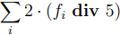

# Generator's Income

A node's income from adding a new block to the blockchain consists of the following amounts:

1. Block reward. The current reward size is 6 WAVES but it can be changed by voting, see the [Block Reward](/en/blockchain/mining/mining-reward) article.
2. 40% of the total transaction fees in the current block. The exact value is calculated as follows:

   

    Here *fi* is the fee for the *i*-th transaction. For each transaction fee, an integer division by 5 is performed, then a multiplication by 2, and finally they are summed up.

3. 60% of the total transaction fees in the previous block.

   

   The block generator receives exactly the part of the fee that the previous block generator did not receive.

If the [transaction fee](/en/blockchain/transaction/transaction-fee) is specified in a sponsored asset, then the block generators receive the fee equivalent in WAVES instead of the fee (as a general rule, in a 40/60 ratio):

`feeInWaves` = `feeInSponsoredAsset` × 0.001 / `minSponsoredAssetFee`

`minSponsoredAssetFee` is the amount of the sponsored asset equivalent to 0.001 WAVES. The sponsor sets this value when enabling sponsorship. For details, see the [Sponsored Fee](/en/blockchain/waves-protocol/sponsored-fee) article.

These rules apply from the height of 1740000, i.e. since activation of feature #14 “Block Reward and Community Driven Monetary Policy”.

## Previous Versions

Height 1090000–1739999

In this range of height, the node's income consisted only of transaction fees. The rules for the fee sharing between the two generators were the same as described above. There was no block reward.

The rules applied from the height of 1090000 which is 10,000 blocks after the activation of feature #7 “Fee Sponsorship”.

Height 805000–1089999

The transaction sender could specify the fee in any asset, and the block generators received the fee in this asset.

The generator of block 805000 received 40% of the total transaction fees in the the block. Generators of subsequent blocks received 40% of the total transaction fees in the current block and 60% of the total transaction fees in the previous block.

The rules applied from the height of 805000, i.e. since activation of feature #2 “NG Protocol”.

Height 2–804999

In this range of height, the block generator received 100% of the total transaction fees in the current block. The transaction sender could specify the fee in any asset.

