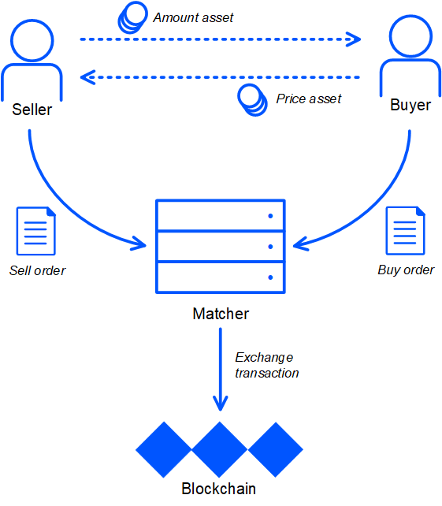

# Exchange Transaction

Exchange transaction exchanges two different tokens among two accounts.

Commonly the exchange transaction is created by the matcher service that executes orders to buy and sell tokens. For detailed information about how the matcher works see the [Waves.Exchange documentation](https://docs.waves.exchange/en/waves-matcher/). See also examples in the [How to buy and sell tokens](/en/building-apps/how-to/basic/trading) article.

The exchange transaction contains two counter orders: a buy order and a sell order. The blockchain guarantees that the terms of the exchange are not worse than those indicated in each order.

One of the two exchanged tokens is an amount asset (base currency): it represents the amount of tokens in orders and in the exchange transaction. Another token is a price asset (quote currency): it represents the price.



## Fee

The minimum fee for an exchange transaction is 0.003 WAVES. In case of exchange of a [smart asset](/en/blockchain/token/smart-asset) for an ordinary asset the minimum fee is 0.007 WAVES, in case of exchange of two smart assets the minimum fee is 0.011 WAVES/

If the transaction sender is a [dApp](/en/blockchain/account/dapp) or a [smart account](/en/blockchain/account/smart-account), the minimum fee is increased by 0.004 WAVES.

## JSON Representation

```json
{
  "senderPublicKey": "9cpfKN9suPNvfeUNphzxXMjcnn974eme8ZhWUjaktzU5",
  "amount": 100000000,
  "fee": 300000,
  "type": 7,
  "version": 2,
  "sellMatcherFee": 750,
  "sender": "3PEjHv3JGjcWNpYEEkif2w8NXV4kbhnoGgu",
  "feeAssetId": null,
  "proofs": [
    "LQD8VoFhHEW2b6o2e2ujzDHdZatwMMwigC2tmoSHcFNRGXrowA1yyVxD6nZBNeABLWjs59dnuLhgNP7UMfFKDuR"
  ],
  "price": 1134500,
  "id": "EHLccXcemZPEvUpM9UkASG1GciwMt9R5B3QuYFxywj9g",
  "order2": {
    "version": 3,
    "id": "JCiF3gmprLc8u7xdWR7KUkJ3YfM6yfgxB6CvhJYGJFAa",
    "sender": "3PRBeeFD64wvTMfS3HEoDDFPXfJs3gFdAxk",
    "senderPublicKey": "ytgWVbKG9e6TSsQ5buMryr2QyxNoL3RezXP3f9RJ2As",
    "matcherPublicKey": "9cpfKN9suPNvfeUNphzxXMjcnn974eme8ZhWUjaktzU5",
    "assetPair": {
      "amountAsset": null,
      "priceAsset": "DG2xFkPdDwKUoBkzGAhQtLpSGzfXLiCYPEzeKH2Ad24p"
    },
    "orderType": "sell",
    "amount": 40000000000,
    "price": 1134500,
    "timestamp": 1591356602063,
    "expiration": 1593862202062,
    "matcherFee": 300000,
    "matcherFeeAssetId": null,
    "signature": "3D2Ngr7H6MQRs1izMQSix3dMHmDfg4bcRjxamFXFsb4Ku28neNWHdtwE6LtR3eq69Jqr1CvEsAKCWkQEeEEomcoK",
    "proofs": [
      "3D2Ngr7H6MQRs1izMQSix3dMHmDfg4bcRjxamFXFsb4Ku28neNWHdtwE6LtR3eq69Jqr1CvEsAKCWkQEeEEomcoK"
    ]
  },
  "order1": {
    "version": 3,
    "id": "FNvEGPgUqEWnrnpxevZQnaZS3DUTBGE2wa6L75xCw7mo",
    "sender": "3PDxxx7eSeYLgzTAtuAV7gUCtHeeXeU85fP",
    "senderPublicKey": "3WEkbavP3Sw4y5tsgxbZvKkWh87BdB3CPVVxhcRUDBsJ",
    "matcherPublicKey": "9cpfKN9suPNvfeUNphzxXMjcnn974eme8ZhWUjaktzU5",
      "assetPair": {
      "amountAsset": null,
      "priceAsset": "DG2xFkPdDwKUoBkzGAhQtLpSGzfXLiCYPEzeKH2Ad24p"
    },
    "orderType": "buy",
    "amount": 100000000,
    "price": 1134500,
    "timestamp": 1591356752271,
    "expiration": 1593862352271,
    "matcherFee": 300000,
    "matcherFeeAssetId": null,
    "signature": "2gvqaYy2BFbK4BJZS8taRJnhgfQ1z2CytF2RqjcyEfzFiu9tkTjN5q4UyFXpPqS3E6eD2WQBUaYCTYDKv98iW1sy",
    "proofs": [
      "2gvqaYy2BFbK4BJZS8taRJnhgfQ1z2CytF2RqjcyEfzFiu9tkTjN5q4UyFXpPqS3E6eD2WQBUaYCTYDKv98iW1sy"
    ]
  },
  "buyMatcherFee": 300000,
  "timestamp": 1591356752456,
  "height": 2093333
}
```

| Field | Description |
| :--- | :--- |
| amount | Amount of the amount asset: an integer value specified in the minimum fraction (“cent”) of asset |
| price | Price for the amount asset nominated in the price asset, multiplied by the factor:<br>- 10<sup>8</sup> for the exchange transaction version 3;<br>- 10<sup>8 + priceAssetDecimals – amountAssetDecimals</sup>, where `amountAssetDecimals`, `priceAssetDecimals` are `decimals` of the assets, for the exchange transaction version 2 or 1 |
| buyMatcherFee | Matcher fee for the buy order execution. The fee token ID is indicated in buy order |
| sellMatcherFee | Matcher fee for the sell order execution. The fee token ID is indicated in sell order |
| order1, order2 | Buy and sell orders. See the [Order](/en/blockchain/order) article for details |

The fields that are common to all types of transactions are described in the [Transaction](/en/blockchain/transaction/#json-representation) article.

## Binary Format

See the [Exchange Transaction Binary Format](/en/blockchain/binary-format/transaction-binary-format/exchange-transaction-binary-format) article.

## Ride Structure

The [ExchangeTransaction](/en/ride/structures/transaction-structures/exchange-transaction) structure is used for transaction handling in smart contracts.
