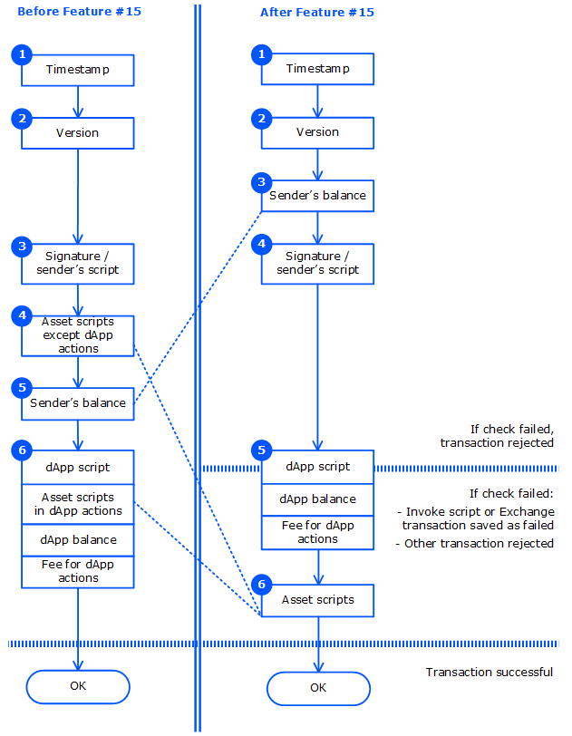

# Transaction Validation

Waves nodes validate each transaction. Depending on the validation result the transaction can be saved on the blockchain or rejected.

Since node version 1.2.4, after activation of feature #15 “Ride V4, VRF, Protobuf, Failed transactions” the transaction validation procedure is changed.

> :warning: After activation of the feature #15, the fee for the Invoke Script transaction cannot be funded by transfer from the dApp to the transaction sender. If sender's balance is insufficient to pay the fee, dApp script is not executed.

## Before Activation of Feature #15

The following checks are performed:

1. Transaction fields check including:

   • Timestamp check: the transaction timestamp should be not more than 2 hours ago or 1.5 hours ahead from the current block timestamp.

   • Transaction version check: all the features required to support this version should be activated.

   • Transaction type check: all the features required to support this type should be activated.

   • Check of fields depending on the transaction type.

2. The sender's signature verification for ordinary account (without script), or account script execution if the sender is [smart account](/en/blockchain/account/dapp), or the [verifier function](/en/ride/functions/verifier-function) execution if the sender is [dApp](/en/blockchain/account/dapp). A similar check is performed for orders in an Exchange transaction.

3. Execution of asset scripts if the transaction uses [smart assets](/en/blockchain/token/smart-asset), except scripts of assets used in [dApp script actions](/en/ride/structures/script-actions/) that are executed in step 5.
4. Sender's balance check.

   The sender should have enough funds to pay the fee. If a sponsored asset is used for the fee, the sponsor's balance is also checked.

   Depending on the type of transaction, the sender should have enough asset for transfer or for payments attached to the Invoke Script transaction. Order senders in the Exchange transaction should have enough funds to exchange.

5. For an Invoke Script transaction:

   5.1. Calculation of the result of dApp callable function.

   5.2. Execution of asset scripts if [dApp script actions](/en/ride/structures/script-actions/) use smart assets.

   5.3. dApp balance check: dApp account should have enough funds for script actions.

   5.4. Check that the transaction fee is not less than the minimum fee based on script actions.

The transaction is saved on the blockchain and the transaction fee is charged if all checks passed.

## After Activation of Feature #15

The following checks are performed:

1. Transaction fields check including:

   • Timestamp check: the transaction timestamp should be not more than 2 hours ago or 1.5 hours ahead from the current block timestamp.

   • Transaction version check: all the features required to support this version should be activated.

   • Transaction type check: all the features required to support this type should be activated.

   • Check of fields depending on the transaction type.

2. Sender's balance check.

   The sender should have enough funds to pay the fee. If a sponsored asset is used for the fee, the sponsor's balance is also checked.

   Depending on the type of transaction, the sender should have enough asset for transfer or for payments attached to the Invoke Script transaction. Order senders in the Exchange transaction should have enough funds to exchange.

3. The sender's signature verification for ordinary account (without script), or account script execution if the sender is [smart account](/en/blockchain/account/dapp), or the [verifier function](/en/ride/functions/verifier-function) execution if the sender is [dApp](/en/blockchain/account/dapp). A similar check is performed for orders in an Exchange transaction.
4. For the Invoke Script transaction:

   4.1. Calculation of the result of dApp callable function.

   4.2. dApp balance check: dApp account should have enough funds for [dApp script actions](/en/ride/structures/script-actions/).

   4.3. Check that the transaction fee is not less than the minimum fee based on script actions.

5. Execution of asset scripts if the transaction uses [smart assets](/en/blockchain/token/smart-asset), including scripts of assets used in dApp script actions.

### Validation Result

For the Invoke Script transaction:
* If one of the checks 1–3 failed, the transaction is **rejected**.
* If checks 1–3 passed, and the calculation of the result of the dApp callable function (check 4.1) failed with an error or [throwing an exception](/en/ride/exceptions) before the [complexity](/en/ride/base-concepts/complexity) of performed calculations exceeded the [threshold for saving failed transactions](/en/ride/limits/), the transaction is also **rejected**.
* If checks 1–3 passed but checks 4–5 failed and besides the result of the callable function is calculated successfully or the complexity exceeded the threshold, the transaction is **saved on the blockchain but marked as failed**: `"applicationStatus": "script_execution_failed"`. The sender is charged the transaction fee. The transaction doesn't entail any other changes to the state of the blockchain.
* If all checks passed, the transaction is saved on the blockchain as **successful**: `"applicationStatus": "succeeded"` and the sender is charged the fee.

For the Exchange transaction:
* If one of the checks 1–3 failed, the transaction is **rejected**.
* If checks 1–3 passed but check 5 failed, the transaction is **saved on the blockchain but marked as failed**: `"applicationStatus": "script_execution_failed"`. The sender of the transaction (matcher) is charged the transaction fee. The transaction doesn't entail any other changes in balances, in particular, the order senders don't pay the [matcher fee](/ru/blockchain/transaction-type/exchange-transaction#matcher-fee).
* If all checks passed, the transaction is saved on the blockchain as **successful**: `"applicationStatus": "succeeded"`. The matcher is charged the transaction fee as well as the order senders are charged the matcher fee.

For the other transaction:
* If one of the checks failed, the transaction is rejected.
* If all checks passed, the transaction is saved on the blockchain as successful and the sender is charged the fee.
