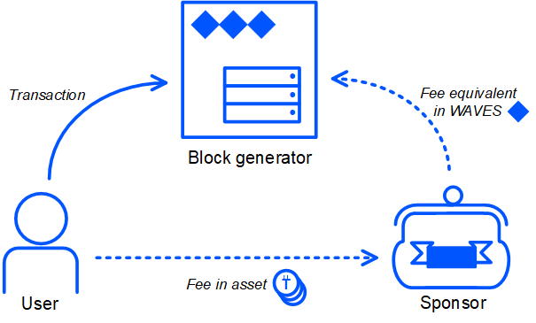

# Sponsored Fee

Users of Waves-based apps should pay a fee for each transaction. This is the entry threshold for new users. Sometimes users don't know anything about WAVES or don't understand how to get WAVES or don't want to spend money. Sponsorship enables launching apps that do not require WAVES from users.

## Sponsored asset

An account that launched an asset can enable sponsorship, that is, allow all users to pay a fee in this asset for invoke script transactions and transfer transactions. The sponsor can distribute the sponsored asset among app users.

## How It Works

After [enabling sponsorship](#how-to-enable-sponsorsip), if the requirements described in the [Restrictions](#restrictions) section are met, the sponsorship works as follows:

1. A user broadcasts a transaction and specifies a fee in the sponsored asset.
2. The sponsor receives the fee in the sponsored asset from the user's account.
3. Block generators receive the fee in WAVES from the sponsor's account (in accordance with the [Waves-NG](/en/blockchain/waves-protocol/waves-ng-protocol) protocol, the fee is distributed between the current block generator and the next block generator in a ratio of 40/60).

> The script on the sponsor's account is not executed and does not affect the sponsorship because the transaction is sent from the user's account.

The fee in WAVES charged to the sponsor is proportional to the fee specified by the transaction sender:

`feeInWaves` = `feeInSponsoredAsset` × 0,001 / `minSponsoredAssetFee`

`minSponsoredAssetFee` is the amount of sponsored asset equivalent to 0.001 WAVES. The sponsor sets this value when enabling sponsorship.

For example, if the sponsor sets 3 tokens = 0.001 WAVES, then the minimum fee for invoke script transaction is 15 tokens, which corresponds to 0.005 WAVES.

:warning: Please note:

* The user can use the sponsored asset to pay for transactions that are not related to a certain app.
* The user can specify any amount of fee, such as the one significantly exceeding the minimum.

## How to Enable Sponsorship

To enable sponsorship, you need to put a sponsor fee transaction  with `minSponsoredAssetFee` specified in it. [Example of transaction](https://wavesexplorer.com/testnet/tx/5gHUMzmBfn4KP3tELzHtw3EYR947rzWUp5PuyF7hUW23)

> In the binary and JSON representation of the transaction, the value of `minSponsoredAssetFee` is specified in the minimum fraction (“cent”) of the sponsored asset.

There are the following options to put the transaction:
* In [Waves.Exchange](https://waves.exchange/) app developed by Waves.Exchange team. See the [Sponsored Transaction](https://docs.waves.exchange/en/waves-exchange/waves-exchange-online-desktop/online-desktop-asset/online-desktop-sponsored-trx) article of Waves.Exchange documentation.
* Using [client libraries](/en/building-apps/waves-api-and-sdk/client-libraries/). See also the [Creating and broadcasting transactions to the blockchain](/en/building-apps/how-to/basic/transaction) article.

The fee for this type of transaction is 1 WAVES.

## How to Disable Sponsorship

To disable sponsorship, you need to put a sponsor fee transaction in which `minSponsoredAssetFee` is `null`.

## Restrictions

* Only the issuer of the asset can be a sponsor.
* Smart asset cannot be a sponsored asset.
* Sponsorship only works if the sponsor's account balance is greater than 1.005 Waves. If the account balance becomes less than 1.005 Waves, the sponsorship is suspended, and if the balance becomes more than 1.005 Waves the sponsorship is resumed.
* The fee in the sponsored asset can only be specified for invoke script transactions and transfer transactions.

## Discussion

Improvement of sponsorship is discussed at the Waves community forum in the [WEP-2 Customizable Sponsorship](https://forum.wavesplatform.com/t/wep-2-customizable-sponsorship/15880) section.
