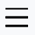
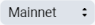
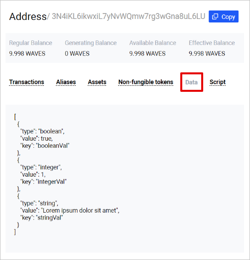

# How to Read Blockchain Data

All the data in the Waves blockchain is public and can be read by anyone. For example, you can retrive data from account data storage, account balance, a list of transactions by certain account, or current blockchain height and time.

You can send a request to your own node or to one of the Waves nodes with public API:
* Testnet: <https://nodes-testnet.wavesnodes.com>
* Mainnet: <https://nodes.wavesnodes.com>

## Data from Account Data Storage

Each account on the Waves blockchain has an account data storage that stores data records in key-value format. See the [Account Data Storage](/en/blockchain/account/account-data-storage) section for more information.

### Using Waves Explorer

1. Open <https://wavesexplorer.com/>.
2. Press  button and switch to  or .
3. Search for an account by its address or alias.
4. Switch to **Data** tab.



### Using Node REST API

To retrieve all the data records from an account data storage, use `GET /addresses/data/{address}` method.

To retrieve a data record by key, use `GET /addresses/data/{address}/{key}` method.

See method descriptions in [Swagger web interface](https://nodes-testnet.wavesnodes.com/).

**Request example:**

```
curl 'https://nodes-testnet.wavesnodes.com/addresses/data/3N4iKL6ikwxiL7yNvWQmw7rg3wGna8uL6LU'
```

The examples shown here and below are suitable for the `cURL` utility. You can adjust the proposed request to your app written in any programming language.

### Using JavaScript

Use functions of `waves-transactions` library:

* `accountData` function retrieves all the data records from an account data storage, optionally filtered by certain regexp.
* `accountDataByKey` retrieves a data record by key.

See [library documentation](https://wavesplatform.github.io/waves-transactions/modules/nodeinteraction.html) on Github.

**Example:**

```js
import { nodeInteraction } from "@waves/waves-transactions";

const nodeUrl = 'https://nodes-testnet.wavesnodes.com';
const address = '3N4iKL6ikwxiL7yNvWQmw7rg3wGna8uL6LU';

let stringVal = await nodeInteraction.accountDataByKey('stringVal',address,nodeUrl);

console.log('stringVal: ' + stringVal.value);
```

### Using Python

```
Could anybody help me?
```

## Account Balance

Each account can store different assets (also called tokens) in different amounts. For WAVES, there are four types of balance: regular, effective, available, and generating. See the [Account Balance](/en/blockchain/account/account-balance) for more information.

### Using Waves Explorer

1. Open <https://wavesexplorer.com/>.
2. Press  button and switch to  or .
3. Search for an account by its address or alias.
4. Balances in WAVES are displayed below the address. Switch to **Assets** tab to see balances in other tokens.


> NFTs are displayed on the **Non-fungible tokens** tab.

### Using Node REST API

To retrieve all types of balalnces of WAVES, use `GET /addresses/balance/details/{address}` method.

To retrieve balances of other assets, use `GET /assets/balance/{address}` or `GET /assets/balance/{address}/{assetId}` method.

See method descriptions in [Swagger web interface](https://nodes-testnet.wavesnodes.com/).

> :bulb: The easiest way to find out the asset ID by its name and vice versa is to open [Waves.Exchange](https://waves.exchange/) app developed by Waves.Exchange team, go to the **Trading** page and type a name or asset ID in the search bar.


**Request example:**

```
curl 'https://nodes.wavesnodes.com/assets/balance/3P8pGyzZL9AUuFs9YRYPDV3vm73T48ptZxs/G9hT3ntXUenjCr2UwXRVa1PP6kWZtfotBLGYhfw8J7GG'
```

You can adjust the proposed request to your app written in any programming language.

> To get a list of NFTs that belong to account, use `GET /assets/nft/{address}/limit/{limit}` method.

### Using JavaScript

#### Without User Authentication

You can use functions of `waves-transactions` library:

* `balanceDetails` function retrieves all types of balalnces of WAVES.
* `assetBalance` function retrieve balances of other assets.

See [library documentation](https://wavesplatform.github.io/waves-transactions/modules/nodeinteraction.html) on Github.

**Example:**

```js
import { nodeInteraction } from "@waves/waves-transactions";

const nodeUrl = 'https://nodes-testnet.wavesnodes.com';
const address = '3Mvpp7v6G11tKNgsoNhbgnZS9thdZ6TvAXK';
const assetId = 'DG2xFkPdDwKUoBkzGAhQtLpSGzfXLiCYPEzeKH2Ad24p';

let wavesBalance = await nodeInteraction.balanceDetails(address,nodeUrl);
let assetBalance = await nodeInteraction.assetBalance(assetId,address,nodeUrl);

console.log('WAVES available balance: ' + wavesBalance.available);
console.log('WAVES effictive balance: ' + wavesBalance.effective);
console.log('Neutrino balance: ' + assetBalance.balance);
```

#### With User Authentication

If user is authenticated in your app, you can use functions of `Signer` library:

* `getBalance` provides balances of all assets in user's portfolio. For WAVES, available balance is returned.
* `getSponsoredBalances` prodives balances of sponsored assets in user's portfolio. См. [Sponsored Fee Transactions](https://docs.wavesplatform.com/en/blockchain/waves-protocol/sponsored-fee).

See [Signer documentation](/en/building-apps/waves-api-and-sdk/client-libraries/signer).

**Example:**

```js
import Signer from '@waves/signer';
import Provider from '@waves.exchange/provider-web';

// Library initialization

const signer = new Signer({
  NODE_URL: 'https://nodes-testnet.wavesnodes.com'
});
signer.setProvider(new Provider());

const user = await signer.login();
let balances = await signer.getBalance();

console.log('User balances: ' + JSON.stringify(balances));
```

### Using Python

```
I need help!
```

## List of Transactions by Address

You can get a list of transactions related to the specified account: outgoing transactions that are sent from the account; incoming transfers; exchanges that the account participated in; dApp script invocations etc.

### Using Waves Explorer

1. Open <https://wavesexplorer.com/>.
2. Press  button and switch to  or .
3. Search for an account by its address or alias.
4. Switch to **Transactions** tab.

### Using Node REST API

To retrieve all the transactions related to an account, use `GET /transactions/address/{address}/limit/{limit}` method. In this method, you can use pagination: to get the next page, specify the `after` parameter as ID of the last transaction in previous response.

See method description in [Swagger web interface](https://nodes-testnet.wavesnodes.com/).

**Request example:**

```
curl 'https://nodes-testnet.wavesnodes.com/address/3N4iKL6ikwxiL7yNvWQmw7rg3wGna8uL6LU/limit/20?after=5VsNkFuEsxwaZRHezQkTsfkf7cJxjRGBiahn3H1raKsT'
```

You can adjust the proposed request to your app written in any programming language.

### Using JavaScript

You can use the `fetchTransactions` function of `node-api-js` library.

**Example:**

```js
import { create } from "@waves/node-api-js";

const  nodeUrl = 'https://nodes-testnet.wavesnodes.com';
const api = create(nodeUrl);

let address = '3Mz9N7YPfZPWGd4yYaX6H53Gcgrq6ifYiH7';

let txList = await api.transactions.fetchTransactions(address,10);

тут хорошо бы описать, как получить весь список (не только первую страницу)
```

### Using Python

```
Could anybody help me?
```

## Blockchain Height and Current Time

The block height is a sequence number of a block in the blockchain. The blockchain height is a sequence number of the last block.

You can use timestamp of the last block as a current time of the blockchain.

### Using Waves Explorer

1. Open <https://wavesexplorer.com/>.
2. Press  button and switch to Mainnet ot Testnet.
3. Current height is displayed above the block list. Click block number to see timestamp.

### Using Node REST API

To retrieve the blockchain height only, use `GET /blocks/height` method.

To retrieve all the headers of the last block, including height and timestamp, use `GET /blocks/headers/last` method.

See method descriptions in [Swagger web interface](https://nodes-testnet.wavesnodes.com/).

**Request example:**

```
curl 'https://nodes-testnet.wavesnodes.com/blocks/headers/last'
```

You can adjust the proposed request to your app written in any programming language.

> To get the entire block, both headers and transactions, use `GET /blocks/last` method.

### Using JavaScript

You can use the `fetchHeadersLast` function of `node-api-js` library.

**Example:**

```js
import { create } from "@waves/node-api-js";

const  nodeUrl = 'https://nodes-testnet.wavesnodes.com';
const api = create(nodeUrl);

let top = await api.transactions.fetchHeadersLast();

console.log('Currrent height: ' + top.height);
console.log('Current time: '+ top.timestamp);
```

### Using Python

```
Could anybody help me?
```
