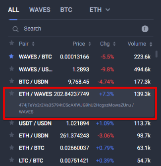

# How to Buy and Sell Tokens

All the assets issued on the Waves blockchain (except [NFTs](/en/blockchain/token/non-fungible-token)) can be bought or sold on [Waves.Exchange](https://waves.exchange/) developed by Waves.Exchange team.

Waves.Exchange app is a part of the Waves ecosystem. It combines user wallet and decentralized exchange that executes trades swiftly and securely.

To buy or sell tokens, you submit an order to matcher (exchange engine). You don't transfer your assets to exchange, money remains on your account until matcher executes the order and creates an exchange transaction. The blockchain guarantees that the transaction will be made on the conditions that are not worse than in the user's order.

See the [Order](/en/blockchain/order) article for more information about orders.

## Create Trading Order

### Using Waves.Exchange

You can use online, desktop or mobile app. See the [Start Trading (Online & Desktop)](https://docs.waves.exchange/en/waves-exchange/waves-exchange-online-desktop/online-desktop-trading) and [Start Trading (Mobile)](https://docs.waves.exchange/en/waves-exchange/waves-exchange-mobile/mobile-trading/mobile-start-trading) articles of the Waves.Exchange documentation.

### Using JavaScript

#### Set Matcher Params

Use the following matcher URL:

* Testnet: <https://matcher-testnet.wavesnodes.com>
* Mainnet: <https://matcher.waves.exchange>

Use the `GET /matcher` method of matcher API to retrieve matcher public key.

#### Set Asset Pair

An asset pair consists of two assets you want to exchange: amount asset and price asset. Under the order, you can either sell or buy the amount asset for the price asset.

For Mainnet, you can see asset pairs and asset IDs on the **Trading** page of Waves.Exchange. The first asset in pair is the amount asset and the second one is the price asset.



For both Mainnet and Testnet, you can get asset pairs using `GET /matcher/orderbook` or `GET /matcher/settings` API method. For more information, see [matcher API](https://docs.waves.exchange/en/waves-matcher/matcher-api) article of Waves.Exchange documentation.

> :warning: Asset IDs differ on Mainnet and Testnet.

WAVES, the core token of Waves blockchain, doesn't have an asset ID, use 'WAVES' instead.

#### Set Orders Fields, Sign Order and Send to Matcher

Use functions of `waves-transactions` library:

* `order` function creates and signs an order. Order proof is derived from seed. By default, matcher fee is calculated automatically.
* `submitOrder` sends signed order to matcher.

See function descriptions in [waves-transactions documentation](https://wavesplatform.github.io/waves-transactions/index.html) on Github.

```javascript
import { order, submitOrder } from "@waves/waves-transactions";

const matcherUrl = 'https://matcher-testnet.wavesnodes.com';
const matcherPublicKey: '8QUAqtTckM5B8gvcuP7mMswat9SjKUuafJMusEoSn1Gy';

const amountAssetId: 'BrmjyAWT5jjr3Wpsiyivyvg5vDuzoX2s93WgiexXetB3'; // asset ID of ETH on Testnet
const priceAssetId: 'WAVES';

const seed = 'insert your seed here';

const orderParams = {
    amount: 100000000, // 1 ETH: actual volume of amount asset multiplied by 10^amountAssetDecimals
    price: 19900000000, // 199 WAVES for 1 ETH: actual price denominated in priceAsset and multiplied by 10^(8 + priceAssetDecimals – amountAssetDecimals)
    amountAsset: amountAssetId,
    priceAsset: priceAssetId,
    matcherPublicKey: matcherPublicKey,
    orderType: 'buy'
}

const signedOrder = order(orderParams, seed);
await submitOrder(signedOrder, matcherUrl);

let orderId = signedOrder.id;
console.log('Order ID: '+ orderId);
```

### Using Python

```python
import pywaves as pw

matcher_url = 'https://matcher-testnet.wavesnodes.com'
pw.setMatcher(matcher_url)

# ETH asset on Testnet
amount_asset = pw.Asset('BrmjyAWT5jjr3Wpsiyivyvg5vDuzoX2s93WgiexXetB3')

# WAVES
price_asset = pw.Asset('')

asset_pair = pw.AssetPair(amount_asset, price_asset)

my_address = pw.Address(privateKey='some_private_key')

buy_order = my_address.buy(asset_pair=asset_pair, amount=1e8, price=50e8)

print(f'Buy order ID: {buy_order.orderId}')
```

## Get Order Status

### Using Waves.Exchange

The submitted order is displayed in the **My Open Orders** tab (Online & Desktop app) or in the **My Orders** tab (Mobile) until it is completed. See the [Start Trading (Online & Desktop)](https://docs.waves.exchange/en/waves-exchange/waves-exchange-online-desktop/online-desktop-trading) and [Start Trading (Mobile)](https://docs.waves.exchange/en/waves-exchange/waves-exchange-mobile/mobile-trading/mobile-start-trading) articles of the Waves.Exchange documentation.

### Using Matcher API

To get order status, you need to know order ID and asset pair. Use `GET /matcher/orderbook/{amountAsset}/{priceAsset}/{orderId}` method. Status is returned for orders submitted not earlier than 30 days ago. For partially filled orders, the method aslo returns filled amount.

See method description in [Matcher API](https://docs.waves.exchange/en/waves-matcher/matcher-api) article of Waves.Exchange documentation.

**Request example:**

```
curl 'https://matcher-testnet.wavesnodes.com/matcher/orderbook/BrmjyAWT5jjr3Wpsiyivyvg5vDuzoX2s93WgiexXetB3/WAVES/6hgoJMKAMPVZb11epd2vCjqk47dGcr9eT8cJQ2HpYnHp'
```

The example is suitable for the `cURL` utility. You can adjust the proposed request to your app written in any programming language.

### Using JavaScript

```javascript
const matcherUrl = 'https://matcher-testnet.wavesnodes.com';

const amountAssetId: 'BrmjyAWT5jjr3Wpsiyivyvg5vDuzoX2s93WgiexXetB3'; // asset ID of ETH on Testnet
const priceAssetId: 'WAVES';

const orderId= '6hgoJMKAMPVZb11epd2vCjqk47dGcr9eT8cJQ2HpYnHp';

let response = await fetch(matcherUrl + '/matcher/orderbook/' + amountAsset + '/' + priceAsset + '/' + orderId);
let json = await response.json();
console.log('Order status: ' + json.status);
```

### Using Python

```python
# using order from previous example
print(buy_order.status())
```

## Cancel Order

You can cancel previously submitted order if it's not already filled completely.

### Using Waves.Exchange

You can cancel an order:

* In Online or Desktop app: click **Cancel** in **My Open Orders** tab.
* In Mobile app: tap **X** in **My orders** tab.

### Using JavaScript

The request to cancel the order must be signed by the order sender.

Use functions of `waves-transactions` library:

* `cancelOrder` function creates and signs cancel order request.
* `cancelSubmittedOrder` sends signed request to matcher.

See function descriptions in [waves-transactions documentation](https://wavesplatform.github.io/waves-transactions/index.html) on Github.

**Example:**

```javascript
import {cancelOrder, cancelSubmittedOrder } from "@waves/waves-transactions";

const matcherUrl = 'https://matcher-testnet.wavesnodes.com';

const amountAssetId: 'BrmjyAWT5jjr3Wpsiyivyvg5vDuzoX2s93WgiexXetB3'; // asset ID of ETH on Testnet
const priceAssetId: 'WAVES';

const seed = 'insert your seed here';
const orderId= '6hgoJMKAMPVZb11epd2vCjqk47dGcr9eT8cJQ2HpYnHp';

const co = cancelOrder({ orderId: orderId }, seed);
const cancelledOrder = await cancelSubmittedOrder(co, amountAsset, priceAsset, matcherUrl);

console.log(cancelledOrder.status);
```

### Using Python

```python
# using order from previous example
buy_order.cancel()
```
