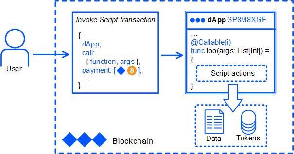
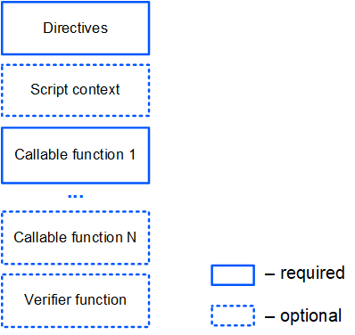

# What is dApp

dApp is Waves account assigned with dApp script.

dApp script is a Ride script that contains сallable functions that can be called externally by the [invoke script transaction](/en/blockchain/transaction-type/invoke-script-transaction).

An invoke script transaction contains:

* dApp address;
* name of the callable function and the argument values;
* in addition, an invoke script transaction can contain payments to be credited to the dApp balance.

[Invoke script transaction example](https://nodes.wavesnodes.com/transactions/info/7CVjf5KGRRYj6UyTC2Etuu4cUxx9qQnCJox8vw9Gy9yq)

You can use callable functions to:

* Add, modify or delete dApp [account data storage](/en/blockchain/account/account-data-storage) entries.
* Transfer, issue, reissue, burn tokens.
* Setup sponsorship.

> Available script actions depend on [Standard library](/en/ride/script/standard-library) version used.



## Structure of dApp Script

dApp script comprises one or more callable functions.

In addition, dApp script can comprise a verifier function that checks transactions and orders that are sent from dApp account.



### Directives

Each Ride script should start with directives. Here is the set of directives for the dApp script:

```ride
{-# STDLIB_VERSION 5 #-}
{-# CONTENT_TYPE DAPP #-}
{-# SCRIPT_TYPE ACCOUNT #-}
```

These directives tell the compiler that:

- The script uses Standard library version 5.
- Type of the script is dApp.
- The script will be assigned to an account (not asset).

### Script Context

Script context includes [built-in variables](/en/ride/variables/built-in-variables) and [built-in functions](/en/ride/functions/built-in-functions/). In addition, user variables and functions could be declared between directives and callable function. These variables and functions are accessible within the entire script.

Example:

```
let someConstant = 42
func doSomething() = {
    1+1
}
```

### Callable Functions

Callable function can be called externally by the invoke script transaction. The callable function should be marked with the `@Callable(i)` annotation, where `i` is an [Invocation](/en/ride/structures/common-structures/invocation) structure that contains invoke script transaction fields that are available to the callable function.

Callable function result is a set of [script actions](/en/ride/structures/script-actions/) that are performed on the blockchain: adding entries to the account data storages, token transfers and others. The result format and the possible actions depend on the Standard library version used.

For a detailed description, see the [Callable Function](/en/ride/functions/callable-function) article.

In the example below the callable function transfers 1 WAVES to an account that called it and records the request information in the account data storage. If the same account tries to call the function again, the callable function does nothing.

```ride
@Callable(i)
func faucet () = {
    let isKnownCaller =  match getBoolean(this, toBase58String(i.caller.bytes)) {
        case hist: Boolean =>
            hist
        case _ =>
            false
    }
    if (!isKnownCaller) then 
        ScriptResult(
           WriteSet([DataEntry(toBase58String(i.caller.bytes), true)]),
           TransferSet([ScriptTransfer(i.caller, 100000000, unit)])
        )
    else WriteSet([])
}
```

### Verifier Function

Verifier function checks transactions and orders that are sent from dApp account (in other words it does the same as the account script). The verifier function should be marked with the `@Verifier(tx)` annotation, where `tx` is the transaction or the order that that the function is currently checking.

For a detailed description, see the [Verifier Function](/en/ride/functions/verifier-function) article.

In the example below the verifier function allows [transfer transactions](/en/blockchain/transaction-type/transfer-transaction) and denies orders and other types of transactions. The [match](/en/ride/operators/match-case) operator is used to specify verification rules depending on the type of transaction (or order).

```ride
@Verifier(tx)
func verify() = {
    match tx {
        case ttx:TransferTransaction => sigVerify(ttx.bodyBytes, ttx.proofs[0], ttx.senderPublicKey)
        case _ => false
    }
}
```

dApp that has no verifier function performs default verification, that is, checking that the transaction or the order is indeed signed by this account.

## Data Accessible by dApp

dApps can read the following blockchain data:

* Entries in account data storages (both dApp's account and any other account).
* Balances of accounts.
* Parameters of assets.
* Blockchain height.
* Headers of blocks.
* Transfer transactions (by transaction ID).

Appropriate fuctions are described in the [Account Data Storage Functions](/en/ride/functions/built-in-functions/account-data-storage-functions) and [Blockchain Functions](/en/ride/functions/built-in-functions/blockchain-functions) articles.

Furthermore:

* The callable function has access to some fields of the transaction that called the dApp script. See the [Invocation](/en/ride/structures/common-structures/invocation) article for the fields description.
* The verifier function has access to the fields of the outgoing transaction or order, including [proofs](/en/blockchain/transaction/transaction-proof).

## Assigning dApp Script to Account

To assign dApp script to an account you need to send a [set script transaction](/en/blockchain/transaction-type/set-script-transaction) from this account.

There are the following options to send the transaction:

* In [Waves IDE](https://waves-ide.com/) create or import an account, open the dApp script and click **Deploy**.
* Using [client libraries](/en/building-apps/waves-api-and-sdk/client-libraries/). See some examples of sending a transaction in the [Creating & Broadcasting Transactions](/en/building-apps/how-to/basic/transaction) article.

[Set script transaction example](https://testnet.wavesexplorer.com/tx/213JdqCLq6qGLUvoXkMaSA2wLSwdzH24BuhHBhcBeHUR)

The fee for the set script transaction is 0.01 WAVES.

After assigning the script, the minimum fee for each transaction sent from  dApp account increases by 0.004 WAVES.

Starting from node version 1.3.1, after activation of feature #16 “Ride V5, dApp-to-dApp invocations”, the extra fee of 0.004 WAVES is only required if the complexity of the verifier function exceeds the [sender complexity threshold](/en/ride/limits/).

## Limitations

Limitations on the size, complexity of the script, as well as on functions and variables are given in the [Limitations](/en/ride/limits/) article.

## Examples

Find dApp script examples:

* In the [How-to Guides](/en/building-apps/how-to/#dapps) chapter.
* In [Waves IDE](https://waves-ide.com/) in the **Library** menu.
* In Github repository [ride-examples](https://github.com/wavesplatform/ride-examples/blob/master/welcome.md).

For tutorial on creating dApp, see the [Creating & Launching dApp](/en/building-apps/smart-contracts/writing-dapps) article.
