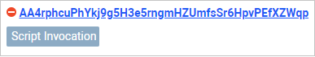

# Saving Failed Transactions (April 2020)

Since node version 1.2.4, after activation of feature #15 “Ride V4, VRF, Protobuf, Failed transactions” the transaction validation procedure is changed.

* Invoke script transactions and exchange transactions are saved on the blockchain and a fee is charged for them even if the dApp script or the asset script failed, provided that the sender's signature or account script verification passed.
* A fee for the invoke script transaction cannot be funded by transfer from dApp to the transaction sender. If sender's balance is insufficient to pay the fee, dApp script is not executed.

[More details about transaction validation](/en/blockchain/transaction/transaction-validation)

In the JSON representation of the transaction, the `applicationStatus` field is added, which contains the result of validation:
* `succeed` – all checks are passed.
* `scriptExecutionFailed` – dApp script or asset script failed. Such a transaction doesn't entail changes in balances (other than charging a fee) and account data storages.

The following Waves tools support failed transactions.

## Node API

Added the `applicationStatus` field to the following endpoints:

   * `GET /transactions/info/{id}`
   * `GET /transactions/status`
   * `POST /transactions/status`

See also [the list of Node API changes in release 1.2](/en/keep-in-touch/release-notes/#обновление-node-api)

## Libraries

**waves-transactions**

The `waitForTx` and `waitForTxWithNConfirmations` return Promise of transaction which is resolved when the transaction is added to the blockchain. Now the `applicationStatus` field has been added to the transaction.

[waves-transactions documentation](https://wavesplatform.github.io/waves-transactions/)

**node-api JS**

The `fetchInfo` and `fetchStatus` functions now support the `applicationStatus` field.

[node-api JS on Github](https://github.com/wavesplatform/node-api-js/)

## Waves Explorer (stagenet.wavesexplorer.com)

* Transactions with failed dApp script or asset script results are displayed. In the list of transactions, they are marked with  icon.

   

* For invoke script transactions the dApp script result is displayed as a table.

[All changes in Waves Explorer](/en/keep-in-touch/release-notes/#waves-explorer-stagenetwavesexplorercom)

## Waves IDE (ide-stagenet.wavesplatform.com)

The `applicationStatus` field for transactions that is added to the blockchain is now supported in JavaScript console and in tests.

Please note: tests now need to check not only that the transaction is added to the blockchain, but also the success of the script.

## Surfboard

The `applicationStatus` field is now supported for transactions added to the blockchain.

[Surfboard on Github](https://github.com/wavesplatform/surfboard)

## Dapp Ui (waves-dapp.com)

For the invoke script transaction, in addition to the transaction status on the blockchain, the status of script execution is displayed.

## Node Go

Node Go also supports failed transactions.

[Node Go on Github](https://github.com/wavesplatform/gowaves/)

## Ride limitations

The maximum complexity of account script and verifier function of dApp script is changed to 3000.

The maximum complexity of asset script and callable function of dApp script remains 4000.

