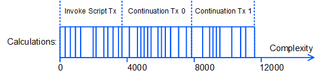
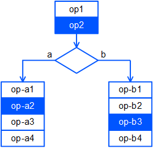

# Continued Calculations

If the complexity of a dApp script exceeds 4000, its execution is split into several stages. A generating note that adds an Invoke Script transaction to a block performs calculations with the total complexity up to 4000 and saves intermediate results in the internal database. Further, the generating node, the same or another one if a new block has already forged, detects an uncompleted calculation sequence, creates a Continuation transaction, and adds it to the block, performing the next stage of calculations. The process continues until the script is completely executed or fails.

Thus, the first stage of claculations is performed within the Invoke Script transaction. The further stages are performed within Continuation transactions. Continuation transaction fields are described in the [Continuation Transaction](/en/blockchain/transaction-type/continuation-transaction) article.

## Conditions

* Continued calculations are added in node version 1.3.0 and enabled with feature #16 “Continuations”. Versions 1.3.x are now available for [Stagenet](/en/blockchain/blockchain-network/) only.fea
* dApp script uses [Standard library](/en/ride/script/standard-library) **version 5**.
* The [Invoke Script](/en/blockchain/transaction) transaction version is 3.

## Suspension of Other Transactions Involving dApp

Until the calculation sequence is complete, transactions that can reduce the dApp balance can be added to the [UTX pool](/en/blockchain/transaction/#utx-pool), but cannot be added to the block:

* Transactions that are sent on behalf of the dApp.
* Transactions that invoke the dApp.
* Exchange transactions in which the dApp is one the order sender.
* Transactions with fee in a sponsored asset issued by dApp.

At the same time, any transfers in favor of dApp, leases and lease cancellations are allowed.

## Blockchain Data Usage

### 1. Entries of dApp's own data storage

Due to the suspension of other transactions involving the dApp (see above), the entries in the dApp's data storage do not change from the start of the script execution until the end. The dApp script can get data from its own storage at any stage, that is, in any of the transactions in the of the calculation sequence, using the following functions:

| Name | Description |
| :--- | :--- |
| getBinary(String): ByteVector&#124;Unit | Gets an array of bytes by key from the dApp's data storage |
| getBinaryValue(String): ByteVector | Gets an array of bytes by key from the dApp's data storage; завершается ошибкой, если запись отсутствует |
| getBoolean(String): Boolean&#124;Unit | Получает значение логической записи по ключу |
| getBooleanValue(String): Boolean | Получает значение логической записи по ключу; завершается ошибкой, если запись отсутствует |
| getInteger(String): Int&#124;Unit | Получает значение целочисленной записи по ключу |
| getIntegerValue(String): Int | Получает значение целочисленной записи по ключу; завершается ошибкой, если запись отсутствует |
| getString(String): String&#124;Unit | Получает значение строковой записи по ключу |
| getStringValue(String): String | Получает значение строковой записи по ключу; завершается ошибкой, если запись отсутствует |

Описание функций см. в разделе [Функции хранилища данных аккаунта](/ru/ride/functions/built-in-functions/account-data-storage-functions).

### 2. Внешние данные блокчейна

К внешним данным относятся все данные блокчейна, кроме записей в собственном хранилище данных dApp, в том числе:

* Записи в хранилищах данных других аккаунтов.
* Балансы аккаунтов, в том числе аккаунта самого dApp.
* Текущая высота блокчейна.
* Параметры ассетов, заголовки блоков, транзакции и др.

Все внешние данные блокчейна, используемые скриптом dApp, должны быть получены на первом этапе вычислений, то есть в исходной транзакции вызова скрипта. Благодаря этому вычисления всех этапов проводятся с одними и теми же данными.

Cложность части скрипта от начала и до последней функции чтения внешних данных включительно не должна превышать 4000.

> Если скрипт содержит ветвления, заранее неизвестно, какая из веток будет выполнена. Поэтому учитывается суммарная сложность по всем веткам. Рассмотрим следующую схему: если операции `op2`, `op-a2` и `op-b3` читают внешние данные блокчейна, то общая сложность операций
`op1 + op2 + op-a1 + op-a2 + op-b1 + op-b2 + op-b3` не должна превышать 4000, иначе dApp-скрипт не может быть установлен.

## Комиссии

Минимальная комиссия, которую должен указать отправитель в транзакции вызова скрипта, рассчитывается по формуле:

`Fee` = (0,005 + `E`) × ⌈`С` / 4000⌉ × + `S` + 0,004 × `P` + 0,004 × `A` + `I`,

где:

   `E` (extra) — надбавка к комиссии за каждый этап вычислений. Отправитель указывает надбавку в поле `extraFeePerStep`. Надбавка предназначена для повышения приоритета обработки транзакции.

   `C` (complexity) — сложность скрипта, `С` / 4000 с округлением вверх до ближайшего целого — количество этапов вычислений,

   `S` (sender) = 0,004, если отправитель транзакции —  [dApp](/ru/blockchain/account/dapp) или [смарт-аккаунт](/ru/blockchain/account/smart-account), и 0 в ином случае,

   `P` (payment) — количество платежей в [смарт-ассетах](/ru/blockchain/token/smart-asset),

   `A` (action) — количество действий скрипта (переводов, довыпусков, сжиганий) со смарт-ассетами,

   `I` (issue) — количество выпущенных скриптом токенов, не являющихся [NFT](/ru/blockchain/token/non-fungible-token).

Отправитель должен учесть в комиссии максимально возможное количество этапов вычислений (сложностью по 4000) и действий скрипта.

Вся сумма комиссии, указанная в транзакции, взимается с отправителя при добавлении транзакции вызова скрипта в блок. Если комиссия указана в спонсорском ассете, со спонсора взимается эквивалент комиссии в WAVES.

Комиссия за выполнение транзакций распределяется следующим образом:

1. За транзакцию вызова скрипта: 0,005 + `E` + `S`.
2. За каждую транзакцию продолжения, кроме последней: 0,005 + `E`.
3. За последнюю транзакцию продолжения: 0,005 + `E` + 0,004 × `P` + 0,004 × `A` + `I`.

(В соответствии с протоколом [Waves-NG](/ru/blockchain/waves-protocol/waves-ng-protocol) 40% комиссии получает генератор блока, в который добавлена транзакция, и 60% комиссии — генератор следующего блока.)

После завершения вычислений неиспользованная часть комиссии возвращается отправителю. Если комиссия указана в спонсорском ассете, спонсору возвращается эквивалент этой части комиссии в WAVES.

> [Порог для сохранения неуспешных транзакций](/ru/ride/limits/) действует только для транзакции вызова скрипта. Если вычисления завершились ошибкой или [выбрасыванием исключения](/ru/ride/exceptions) в рамках транзакции продолжения, она сохраняется на блокчейне как неуспешная и за нее взимается комиссия 0,005 + `E`.

**Рассмотрим пример:**
* Сложность вызываемой функции — 10&nbsp;000.
* Надбавка `E` равна 0,002 WAVES.
* К транзакции приложен платеж в смарт-ассете.
* Вызываемая функция выполняет два перевода смарт-ассета, а также выпуск токена.

Минимальная комиссия за транзакцию вызова скрипта (0,005 + 0,002) × 3 + 0,004 × 2 + 1 = 1,029 WAVES. Если все транзакции будут выполнены успешно, комиссия будет распределена следующим образом:
- за транзакцию вызова скрипта 0,005 + 0,002,
- за первую транзакцию продолжения 0,005 + 0,002,
- за вторую транзакцию продолжения 0,005 + 0,002 + 0,004 × 2 + 1.

Если транзакция вызова скрипта завершится ошибкой (притом что сложность выполненных вычислений превысит порог сохранения неуспешных транзакций), отправитель заплатит 0,005 + 0,002 = 0,007 WAVES. Остаток 1,022 WAVES будет ему возвращен.

Если первая транзакция продолжения завершится ошибкой, отправитель заплатит (0,005 + 0,002) × 2 = 0,014 WAVES. Остаток 1,015 WAVES будет ему возвращен.

Если вторая транзакция продолжения завершится ошибкой, отправитель заплатит (0,005 + 0,002) × 2 = 0,021 WAVES. Остаток 1,008 WAVES будет ему возвращен.

## Статус выполнения транзакции

Поле `applicationStatus` в JSON-представлении транзакции содержит статус выполнения вычислений:

* для всех транзакций в цепочке вычислений, кроме последней: `script_execution_in_progress`,
* для последней транзакции — `succeeded` в случае успеха или `script_execution_failed` в случае ошибки.
