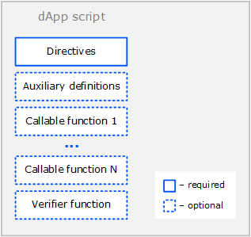

# dApp Script

dApp script enables you to define сallable functions that can be called from other accounts by the [Invoke Script transaction](/en/blockchain/transaction-type/invoke-script-transaction). Callable functions can accept payments to the dApp and perform various actions on the blockchain. Also dApp script can comprise a verifier function that allows or denies transactions and orders that are sent on behalf of the dApp account.

An account with a dApp script assigned to it is called a dApp. For information about how dApp works, see the [What is dApp](/en/building-apps/smart-contracts/what-is-a-dapp) article. Аor information about how to create a dApp, see the [Creating and Running dApp](/en/building-apps/smart-contracts/writing-dapp) article.

## dApp Script Format

The script code is composed of the following parts:

* [Directives](#directives)
* [Auxiliary definitions] (#auxiliary-definitions)
* [Callable functions](#callable-functions)
* [Verifier function](#verifier-function)



### Directives

The dApp script should start with [directives](/en/ride/script/directives):

```scala
{-# STDLIB_VERSION 4 #-}
{-# CONTENT_TYPE DAPP #-}
{-# SCRIPT_TYPE ACCOUNT #-}
```

The above directives tell the compiler that:

- the script uses the Standard Library version 4;
- the script contains a set of definitions;
- the script will be assigned to an account (not asset).

### Auxiliary Definitions

After the directives, you can define auxiliary variables and functions. These variables and functions are accessible within the entire script. Please note that functions without [annotations](/en/ride/functions/annotations) cannot be called outside the dApp script.

Example:

```
let someConstant = 42
func doSomething() = {
    1+1
}
```

### Callable Functions

Callable function can be called from another account via the Invoke Script transaction.

The callable function should be marked with the `@Callable(i)` annotation, where `i` is an [Invocation](/en/ride/structures/common-structures/invocation) structure that contains Invoke Script transaction fields that are available to the callable function. The variable name in the annotation is required even if the function does not use it.

Callable function result is a set of [script actions](/en/ride/structures/script-actions/) that are performed on the blockchain: adding/deleting/modifying entries to the account data storages, token transfers, issue/reissue/burning and others. The result format and the available actions depend on the Standard library version used.

For a detailed description, see the [Callable Function](/en/ride/functions/callable-function) article.

In the example below the callable function transfers 1 WAVES to an account that called it and records the request information in the account data storage. If the same account tries to call the function again, the callable function throws an exception.

```ride
@Callable(i)
func faucet () = {
    let isKnownCaller =  match getBoolean(this, toBase58String(i.caller.bytes)) {
        case hist: Boolean =>
            hist
        case _ =>
            false
    }
    if (!isKnownCaller) then 
        ScriptResult(
           WriteSet([DataEntry(toBase58String(i.caller.bytes), true)]),
           TransferSet([ScriptTransfer(i.caller, 100000000, unit)])
        )
    else throw("Can be used only once")
}
```

### Verifier Function

Verifier function checks transactions and orders that are sent on behalf of the dApp account for compliance with the specified conditions (in other words it does the same as the account script).

The verifier function should be marked with the `@Verifier(tx)` annotation, where `tx` is the transaction or the order that the function is currently checking. The variable name in the annotation is required even if the function does not use it.

The verifier function has no arguments.

Possible results of the verified function are:

* true: the transaction/order is allowed,
* false: the transaction/order is denied,
* error: the transaction/order denied.

For a detailed description, see the [Verifier Function](/en/ride/functions/verifier-function) article.

Using the [match ... case](/en/ride/operators/match-case), you can set up different conditions depending on the type of the transaction/order. For example, the following function allows [transfer transactions](/en/blockchain/transaction-type/transfer-transaction) and denies orders and other types of transactions.

```ride
@Verifier(tx)
func verify() = {
    match tx {
        case ttx:TransferTransaction => sigVerify(ttx.bodyBytes, ttx.proofs[0], ttx.senderPublicKey)
        case _ => false
    }
}
```

dApp script that has no verifier function performs default verification, that is, checking that the transaction or the order is indeed signed by this account.

## Failed Transactions

If the callable function failed with an error or throwing an [exception](/en/ride/exception), provided that:

* the [Invoke Script transaction](/en/blockchain/transaction-type/exchange-transaction) the sender signature verification or the account script verification,
* the complexity of performed calculations exceeded the [threshold for saving failed transactions](/en/ride/limit),

then such a transaction is saved on the blockchain and marked with the attribute

```
"applicationStatus": "script_execution_failed"
```

The transaction sender is charged a fee. The transaction doesn't entail any other changes in balances.

[More about transaction validation](/en/blockchain/transaction/transaction-validation)

[More about handling failed transactions](/en/keep-in-touch/april)

## Data Accessible by dApp Script

Data accessible by the **callable** function:

* Particular fields of the transaction that called the dApp script, including payments, fee, sender address and public key. See the [Invocation](/en/ride/structures/common-structures/invocation) article for the fields description. Proofs are unaccessible.
* [Blockchain data](/en/ride/#blockchain-operation): current height, account balances, account data storage entries, token fields, etc.

Data accessible by the **verifier** function:

* Fields of the current verified transaction/order, including `proofs`. The built-in variable `tx` contains this transaction or order. The set of fields depends on the type of transaction/order, see the [Transaction Structures](/en/ride/structures/transaction-structures/) and [Order](/en/ride/structures/common-structures/order) articles.
* [Blockchain data](/en/ride/#blockchain-operation): current height, account balances, account data storage entries, token fields, etc.

   : warning: Blockchain data is available only when checking a transaction and not available when checking an order (`case t: Order`).

## Examples

Find dApp script examples:

* In the [How-to Guides](/en/building-apps/how-to#dapps) chapter.
* In [Waves IDE](https://waves-ide.com/) in the **Library→ dApps** menu.
* In Github repository [ride-examples](https://github.com/wavesplatform/ride-examples/blob/master/welcome.md).
