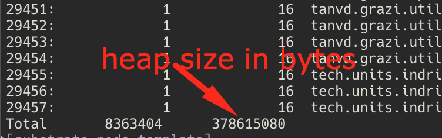
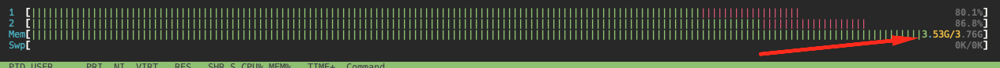
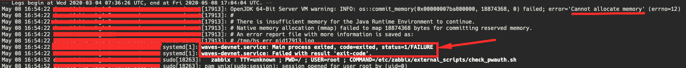

# Node Troubleshooting (PDF)

This article describes known issues of Waves node and their possible solutions:

* [Node does not achieve height and does not respond to requests](#node-achieves-height-and-does-not-respond-to-requests)
* [Node achieves height and responds to requests, but is possibly on fork](#anchor1)
* [Problems related to OutOfMemoryError](#anchor2)

## Node does not achieve height and does not respond to requests

* Make sure that the node is running. If the command `ps aux | egrep '[w]aves'` returns empty output, run the node with the following command:

   ```bash
   sudo systemctl start waves
   ```

* Make sure that you have enough disk space:

   ```bash
   df -h --output=avail /
   ```

* Make sure that the node is running with correct configuration file. See node configuration file description in the following article: https://docs.wavesprotocol.org/en/waves-node/node-configuration.

* If the `waves.log` file contains the `Storage version $version is not compatible with expected version $StorageVersion! Please, rebuild node's state, use import or sync from scratch.` error message perform the activities described in the following article: https://docs.wavesprotocol.org/en/waves-node/options-for-getting-actual-blockchain/state-downloading-and-applying.

   Find the error in the log file with the following command:

   ```bash
   sudo grep -e 'Storage version .* is not compatible' /var/log/waves/waves.log`
   ```

## Node achieves height and responds to requests, but is possibly on fork <a name="anchor1"></a>

### Detect fork with Chaincmp

To detect fork with Chaincmp utility do the following:

1. Execute the following command:

   ```bash
   git clone https://github.com/wavesplatform/gowaves.git
   ```

2. Execute the following command:

   ```bash
   cd /gowaves/cmd/chaincmp
   ```

3. Execute the following command:

   ```bash
   go run chaincmp.go -n $YOUR_NODE_URL
   ```

**Note**: by default the node is compared with https://nodes.wavesnodes.com/, to compare the node with other node/pool use the desired url after `-r`.

For details see the following article: https://github.com/wavesplatform/gowaves/blob/master/cmd/chaincmp/README.md.

### Alternative method to detect fork

1. Compare block signature at the second-last height of your node with the block signature of the official node pool at the same height with the following command:

   ```bash
   curl -X GET "https://nodes.wavesnodes.com/blocks/headers/at/{last - 1 height}" | less
   ```

   **Note**: for node version 1.2 and higher, signature = id.

   If the signatures differ, then your node is on fork. In this case:

2. Determine the latest common block that has similar height and signature with the same block in official node pool.
3. Find the log record about the first rejected block after the latest common block with the following command:

   ```bash
   grep -A 1000 "Appended Block({signature}" | grep -m 1 "Error appending .* GenericError(Block Block(" waves.log
   ```

   where {signature} - signature/id of the latest common block.

4. Find the error describing the block rejection reason at the end of the record.

   Fixing fork is required in case of the following errors:
   i. `Block time 1589438183183 less than expected`. This error inderectly says that the miner has insufficient WAVES balance for mining.
   ii.`Attempt to transfer unavailable funds: Transaction application leads to negative waves balance` (and other errors containing `balance` word).

### Fixing fork

* Perform the activities described in the following article: https://docs.wavesprotocol.org/en/waves-node/options-for-getting-actual-blockchain/state-downloading-and-applying.
* If your logs contain other errors then described in step 4 above, send `waves.log` (or the fragment of the log before `Appended Block({signature}` error record) to Waves team.

   **Note**: The `BlockAppendError (Block is not a child of last block ...)` error can not cause fork. Don't worry about such records. Logging of such errors will be improved in later node versions.

## Problems related to OutOfMemoryError <a name="anchor2"></a>

If the node stopped and does not reply to requests сheck logs to determine if there is `OutOfMemoryError` error:

i. The error can be found in the current day log in `/var/log/waves/waves.log` file. Find the error with the following command:

```bash
sudo tail -n +1 /var/log/waves/waves.log | grep "OutOfMemory"
```

ii. The error can be found in previous days logs archived files `/var/log/waves/*.gz`. Find the error with the following command:

```bash
sudo zgrep -i "OutOfMemory" /var/log/waves/*
```

If you found `OutOfMemoryError` error and the memory, used by the process (heap) exceedes `maximum heap size`, as described in step 2-4 below, you need to troubleshoot memory leaks.

### Detecting memory leaks

1. Check that `syslog` contains a record about the process being killed with OOM-Killer with the following command `dmesg | egrep -i 'killed process'` (empty output means that the process was not killed). If the process was killed restart it with the following command:

   ```bash
   sudo systemctl restart waves
   ```

2. If the process was not killed with OOM-Killer, take `heap dump` with the following command:

   ```bash
   sudo -u $user_running_the_process jmap -histo:live $PID
   ```

   **Note**: To determine `PID` of the desired process execute the following command: `pgrep -f waves`

   In this example the `heap size` is ~ 378.6 Mb:

   

3. If the `heap size` is less than `maximum heap size`, send the heap dump to Waves team. You can check your `Maximum heap size` in `/etc/waves/application.ini` file, `-J-Xmx` parameter. **Example**: `-J-Xmx2g` means that `maximum heap size` = 2 Gb.

4. If the `heap size` is more than `maximum heap size`, restart the process with the following command:

   ```bash
   sudo systemctl restart waves
   ```

**Another possible case**:

You run the node with `sudo systemctl start waves` command and the `htop` utility displays rapid increase of memory usage:


After that waves process fails in `journalctl`:


**Solution**:

1. Take `heap dump` right after starting the process with the following command:

   ```bash
   sudo -u $user_запустивший_процесс jmap -dump:format=b,file=heap.bin3 $PID
   ```

   **Note**: to determine `PID` of the desired process execute the following command: `pgrep -f waves`.

2. Find log `/tmp/hs_err_pid{pid}.log`, where `{pid}` = pid of waves process.
3. Send the file with `heap dump` from step 1 (`heap.bin3`) and `hs_err_pid{pid}.log` from step 2 to Waves team.

### How to take thread dump of the process

In some cases Waves team requires `thread dump` to troubleshoot momory leaks.

To take `thread dump` of the process you can use standard java-utility `jstack $PID > thread_dump.txt` (`pid` of the process - `pgrep -f waves`).
