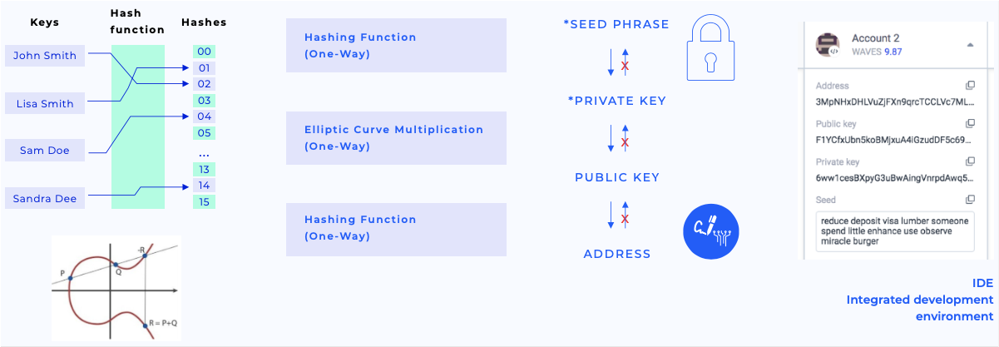

# Аккаунт

Waves использует модель на основе аккаунта:
* Каждая [транзакция](/ru/blockchain/transaction/) создана от имени какого-либо аккаунта.
* Все [токены](/ru/blockchain/token/) принадлежат каким-либо аккаунтам. Подробнее в разделе [Баланс аккаунта](/ru/blockchain/account/account-balance).
* Все данные ассоциированы с каким-либо аккаунтом. Подробнее в разделе [Хранилище данных аккаунта](/ru/blockchain/account/account-data-storage).

## Ключи аккаунта

В отличие от централизованных приложений, на блокчейне у пользователей нет логинов и паролей. Идентификация пользователя и валидация его действий выполняется с помощью криптографически связанной пары ключей:

* Закрытый ключ используется для создания цифровой подписи транзакции или ордера.
* Открытый ключ используется для проверки цифровой подписи.

Каждая транзакция содержит открытый ключ аккаунта-отправителя. Отправитель генерирует цифровую подпись транзакции, используя закрытый ключ аккаунта. С помощью цифровой подписи и открытого ключа можно проверить целостность данных транзакции и достоверность подписи — то есть убедиться, что подпись транзакции соответствует открытому ключу.


В Waves используется асимметричная криптосистема на основе эллиптической кривой Curve25519-ED25519 с ключами X25519. Правила генерации ключей и подписи подробно описаны в разделе [Cryptographic practical details](/en/blockchain/waves-protocol/cryptographic-practical-details).

Закрытый и открытый ключ представляют собой массивы байтов длиной 32. В пользовательских интерфейсах они представлены в виде строк в кодировке [base58](https://ru.wikipedia.org/wiki/Base58). Ключи в кодировке base58 могут иметь разную длину, максимальная длина — 44 символа.

Пример закрытого ключа:

```
6yCStrsBs4VgTmYcSgF37pmQhCo6t9LZk5bQqUyUNSAs
```

Пример открытого ключа:

```
5cqzmxsmFPBHm4tb7D8DMA7s5eutLXTDnnNMQKy2AYxh
```

## Секретная фраза

Закрытый ключ может быть сгенерирован из некоторой случайной исходной фразы с помощью хеширования. Открытый ключ получается из закрытого ключа с помощью умножения эллиптической кривой. [Адрес аккаунта](/ru/blockchain/account/address) получается из открытого ключа. Все эти преобразования однонаправленны. Обратное направление практически невозможно с точки зрения требуемых вычислений.



Исходная **секретная фраза** (seed-фраза) может быть какой угодно, но в приложениях-кошельках Waves используется случайный набор из 15 английских слов. Секретную фразу легче записать или запомнить, чем закрытый ключ, и в то же время ее безопасно использовать с точки зрения криптографии: вероятность подобрать секретную фразу составляет 1/2048<sup>15</sup>.

Пример секретной фразы:

```
body key praise enter toss road cup result shrimp bus blame typical sphere pottery claim
```

:warning: **Предупреждение о безопасности**
* Секретная фраза или созданный из нее закрытый ключ предоставляют полный доступ к аккаунту, включая возможность распоряжаться средствами. Никому не сообщайте секретную фразу и закрытый ключ, не публикуйте и не пересылайте их.
* Секретную фразу нельзя изменить: из другой секретной фразы (даже отличающейся на один символ) получится другая пара ключей, а следовательно, другой аккаунт.
* Если вы потеряете секретную фразу и закрытый ключ, вы утратите доступ к аккаунту навсегда, без возможности восстановления. Рекомендуем записать секретную фразу на бумаге и хранить в надежном месте.
* Если секретная фраза скомпрометирована (вы ее кому-то отправили или подозреваете, что ее узнали мошенники), немедленно создайте новый аккаунт и переведите на него все активы со старого.
* Будьте осторожны, пользуйтесь только рекомендованными приложениями Waves.

О практических способах создания ключей аккаунта читайте в разделе [Как создать аккаунт / кошелек Waves](/ru/blockchain/account/create).
