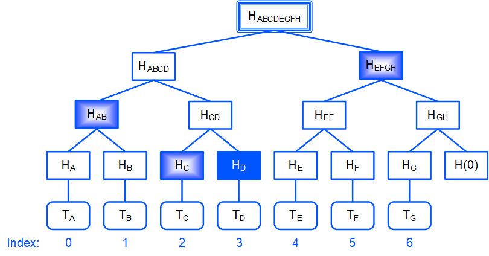

# Корневой хеш транзакций

Поле `transactionsRoot` в заголовке блока представляет собой корневой хеш [дерева Меркла](https://ru.wikipedia.org/wiki/Дерево_хешей) транзакций блока. Корневой хеш является криптографическим доказательством целостности блока, то есть присутствия всех транзакций в заданном порядке.

Корневой хеш транзакций в заголовке блоке позволяет:

* Предоставлять доказательство присутствия транзакции в блоке без предъявления всех транзакций.
* Подписывать только заголовок блока, отдельно от транзакций.

> Поле `transactionsRoot` добавлено в заголовок блока начиная с версии ноды 1.2.0. Эта возможность включается с активацией на ноде функциональности "VRF and Protobuf" (№ 15). На данный момент версии 1.2.x доступны только на [Stagenet](/ru/blockchain/blockchain-network/stage-network).

## Как вычисляется transactionsRoot


1. Вычисляется хеш каждой транзакций в блоке, например:

   H<sub>A</sub> = hash(T<sub>A</sub>)

   H<sub>B</sub> = hash(T<sub>B</sub>)

   и т.д.

2. Хеши объединяются попарно, вычисляется хеш каждого объединения:

   H<sub>AB</sub> = hash(H<sub>A</sub> + H<sub>B</sub>)

   Если количество хешей нечетное, последний хеш объединяется с хешем нулевого байта:
   
   H<sub>GH</sub> = hash(H<sub>G</sub> + hash(0))

3. Шаг 2 повторяется, пока не будет получен корневой хеш:

   H<sub>ABCDEFGH</sub>
   
   Этот хеш записывается в поле `transactionsRoot`.

> Если блок пустой, то `transactionsRoot` = hash(0).

В блокчейне Waves для хеширования используется алгоритм [BLAKE2b-256](https://en.wikipedia.org/wiki/BLAKE_%28hash_function%29).

## Как доказывается присутствие транзакции в блоке

Допустим, на стороне&nbsp;1 имеется полная копия блокчейна, а на стороне&nbsp;2 — только заголовки блоков.

Для доказательства присутствия транзакции в блоке сторона&nbsp;1 предоставляет стороне&nbsp;2 следующие данные:

* `merkleProofs` — массив соседних хешей (верхних хешей соседних веток) на каждом уровне, снизу вверх;
* `index` — порядковый номер транзакции в блоке.



Например, для транзакции T<sub>D</sub>:

* `merkleProofs` = [ H<sub>С</sub>, H<sub>AB</sub>, H<sub>EFGH</sub> ]
* `index` = 3

Сторона 2 проверяет предоставленные доказательства:

1. Вычисляет хеш проверяемой транзакции: хешируются все данные транзакции вместе с подписью:

   H<sub>D</sub> = hash(T<sub>D</sub>)

2. Объединяет хеш с соответствующим соседним хешем из массива `merkleProofs`, вычисляет хеш объединения.

   `index` позволяет определить, с какой стороны находится соседний хеш: если `n`-й бит с конца равен 0, то `n`-й хеш массива `merkleProofs` находится справа, иначе — слева.
   Например, `index` = 3<sub>10</sub> = 11<sub>2</sub>, поэтому:
   
   * `merkleProofs`[0] = H<sub>С</sub> cлева,
   * `merkleProofs`[1] = H<sub>AB</sub> слева,
   * `merkleProofs`[2] = H<sub>EFGH</sub> справа.

3. Повторяет шаг 2, пока не будет получен корневой хеш:

   H<sub>ABCDEFGH</sub>

4. Сравнивает полученный корневой хеш с полем `transactionsRoot` в заголовке блока. Если хеши совпали, значит, транзакция присутствует в блоке.

## Инструменты 

Данные для доказательства присутствия транзакции в блоке предоставляют методы Node API:

* `GET /transactions/merkleProof`
* `POST /transactions/merkleProof`

Описание методов см. в разделе [Транзакции](/ru/waves-node/node-api/transactions).

Для проверки присутствия транзакции на том же блокчейне используется встроенная функция Ride

```
transactionHeightById(id: ByteVector): Int|Unit
```

Функция возвращает высоту блока транзакции, если транзакция с таким `id` присутствует на блокчейне, и `unit` в противном случае. Описание функции см. в разделе [Функции блокчейна](/ru/ride/functions/built-in-functions/blockchain-functions#transactionheightbyid).

Проверка присутствия транзакции в блоке на другом блокчейне возможна при условии, что другой блокчейн также использует алгоритм хеширования [BLAKE2b-256](https://en.wikipedia.org/wiki/BLAKE_%28hash_function%29); в частности, для всех Waves-based блокчейнов. Для проверки используется встроенная функция Ride

```
createMerkleRoot(merkleProofs: List[ByteVector], valueBytes: ByteVector, index: Int): ByteVector
```

Функция вычисляет корневой хеш по предоставленным доказательствам и хешу транзакции (шаги 1–3). Чтобы проверить наличие транзакции в блоке, остается сравнить вычисленный хеш с полем `transactionsRoot` в заголовке блока. Описание функции см. в разделе [Функции верификации](/ru/ride/functions/built-in-functions/verification-functions#createmerkleroothash).

