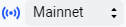
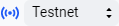
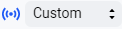
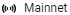
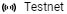
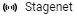

# Сети блокчейна: Mainnet, Testnet, Stagenet

Сеть блокчейна состоит из [нод](/ru/blockchain/node/), взаимодействующих друг с другом.

На базе протокола Waves развернуты несколько сетей блокчейна:

* **Mainnet** — основная сеть Waves. На Mainnet криптовалюты имеют реальную ценность, а владельцы нод получают вознаграждение за генерацию блоков.
* **Testnet** — сеть для отладки приложений. Testnet предоставляет те же функциональности, что и Mainnet. Однако токены WAVES на Testnet  бесплатны, так что вы можете попробовать свой проект без риска потерять реальные деньги.
* **Stagenet** — экспериментальная сеть. На Stagenet тестируются новые функциональности протокола Waves, поэтому возможны откаты высоты блокчейна. Если вы хотите запустить Stagenet-ноду, получить токены в лизинг или задать вопрос, присоединяйтесь к каналу [stagenet](https://discord.gg/3g8XR6B) в Discord.

Кроме того, на базе протокола WAVES вы можете создать собственную (custom) сеть.

:warning: Обратите внимание: данные блокчейна (аккаунты, транзакции, токены) разные в разных сетях.

## Подключение ноды к сети блокчейна

К какой из сетей блокчейна подключается нода, зависит от настройки `waves.blockchain.type` в файле конфигурации ноды. Подробнее о файле конфигурации см. в разделе [Конфигурация ноды](/ru/waves-node/node-configuration).

Способы установки ноды описаны в разделе [Установить ноду Waves](/ru/waves-node/how-to-install-a-node/how-to-install-a-node). Запуск собственной сети блокчейна описан в разделе [Собственный (сustom) блокчейн](/ru/waves-node/private-waves-network).

## Байт сети

Байт сети — символ, который передается нодами при установлении соединения (рукопожатии) и не позволяет ноде подключаться к другим сетям блокчейна.

Байт сети также используется при формировании адресов аккаунтов, поэтому адрес в одной сети блокчейна не может использоваться в другой сети.

| Сеть блокчейна | Байт сети |
| :--- | :--- |
| Mainnet | `W` или 87 (ASCII-код символа `W`) |
| Testnet | `T` или 84 (ASCII-код символа `T`) |
| Stagenet | `S` или 83 (ASCII-код символа `S`) |
| Custom | Символ, выбранный создателем сети и указанный в настройке `address-scheme-character` |

## Инструменты

Приложения экосистемы Waves предоставляют возможность работать с разными сетями блокчейна.

### API пула публичных нод

Адрес для отправки транзакций и чтения данных блокчейна:

| | |
| :--- | :--- |
| Mainnet | <https://nodes.wavesnodes.com/> |
| Testnet | <https://nodes-testnet.wavesnodes.com/> |
| Stagenet | <https://nodes-stagenet.wavesnodes.com/> |

### Waves.Exchange

[Waves.Exchange](https://docs.waves.exchange/ru/) — децентрализованная биржа, разработанная командой Waves.Exchange:

| | |
| :--- | :--- |
| Mainnet | <https://waves.exchange/> |
| Testnet | <https://testnet.waves.exchange/> |
| Stagenet | — |

### API матчера Waves.Exchange

Адрес для отправки ордеров и получения рыночных данных:

| | |
| :--- | :--- |
| Mainnet | <https://matcher.waves.exchange/> |
| Testnet | <https://matcher-testnet.waves.exchange> |
| Stagenet | — |

### Waves Explorer

[Waves Explorer](/ru/ecosystem/waves-explorer/about-waves-explorer) — сервис для просмотра данных блокчейна:

| | |
| :--- | :--- |
| Mainnet | <https://wavesexplorer.com/> Нажмите  и переключитесь на  |
| Testnet | <https://wavesexplorer.com/> Нажмите  и переключитесь на  |
| Stagenet | <https://stagenet.wavesexplorer.com/> |
| Custom | Нажмите  и укажите URL ноды, затем переключитесь на  (подходит только для нод с поддержкой HTTPS) Или запустите Waves Explorer из Docker, см. [инструкцию](https://habr.com/ru/company/waves/blog/459773/) |

### Получение токенов

|  |  |
| :--- | :--- |
| Mainnet | Купить на Waves.Exchange |
| Testnet | [Получить 10 WAVES](https://wavesexplorer.com/testnet/faucet) |
| Stagenet |  [Получить 10 WAVES](https://stagenet.wavesexplorer.com/faucet) |

### Waves IDE

[Waves IDE](/ru/building-apps/smart-contracts/tools/waves-ide) — онлайн-среда для разработки и тестирования смарт-контрактов:

| | |
| :--- | :--- |
| Mainnet | <https://waves-ide.com/> Нажмите  и отметьте Mainnet |
| Testnet | <https://waves-ide.com/> Нажмите  и отметьте Testnet |
| Stagenet | <https://stagenet.waves-ide.com/> |
| Custom | Нажмите , в секции **Custom nodes** укажите URL ноды и байт сети (подходит только для нод с поддержкой HTTPS) |

### Waves Keeper

[Waves Keeper](/ru/ecosystem/waves-keeper/) — расширение браузера для подписания транзакций и управления ключами аккаунта.

| | |
| :--- | :--- |
| Mainnet | В окне Waves Keeper переключитесь на  |
| Testnet | В окне Waves Keeper переключитесь на  |
| Stagenet | В окне Waves Keeper переключитесь на  |
| Custom | В окне Waves Keeper переключитесь на . Укажите URL ноды и матчера |
