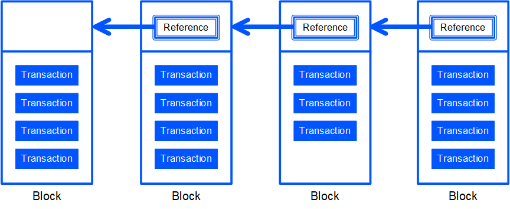
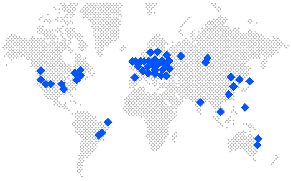
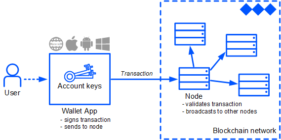

# Основные понятия

**Блокчейн** — технология децентрализованного хранения данных, обеспечивающая их неизменяемость, анонимность и прозрачность.

## Транзакции и блоки

Данные на блокчейне представлены в виде транзакций — записей о действиях, таких как выпуск или перевод криптовалюты, создание или вызов смарт-контракта и т. д.

Транзакции сгруппированы в блоки. Кроме транзакций, блок содержит цифровую подпись ноды, которая сгенерировала блок, и хеш данных предыдущего блока — который, в свою очередь, содержит хеш данных предшествующего ему блока, и т. д. Таким образом, блокчейн состоит из цепочки блоков, связанных с помощью криптографии. Каждая транзакция навсегда остается на блокчейне в первозданном виде: изменение транзакции сделало бы невалидным содержащий ее блок и все последующие блоки.

## Ноды

Сеть Waves состоит из сотен нод по всему миру. Нода — это компьютер, обслуживающий сеть блокчейна. Нода Waves хранит полную копию блокчейна, проверяет валидность всех транзакций и блоков, правильность вычисления хешей и синхронизирует данные с другими нодами. Благодаря этому данные блокчейна защищены от подделки и от удаления. [Запустить свою ноду](/ru/waves-node/how-to-install-a-node/how-to-install-a-node) и присоединиться к сети может любой желающий.

Ноды могут участвовать в генерации новых блоков и получать [вознаграждение за создание блока](/ru/blockchain/mining/mining-reward) и комиссии за транзакции. Чтобы начать генерировать блоки, необходим баланс не менее 1000 WAVES — собственных или [полученных в лизинг](/ru/blockchain/leasing). Чем больше генерирующий баланс ноды, тем больше шанс получить право на генерацию следующего блока.

## Аккаунт

Waves использует модель на основе аккаунта. Каждая транзакция создается от имени какого-либо аккаунта, все активы и данные связаны с аккаунтом. У аккаунта есть пара ключей, связанных с помощью криптографии: закрытый ключ, которым аккаунт подписывает транзакции, и открытый ключ, который позволяет проверить достоверность подписи. [Подробнее об аккаунте](/ru/blockchain/account/)

Для создания аккаунта, хранения ключей и подписания транзакций можно использовать приложения: [Waves.Exchange](https://waves.exchange/) — приложение-кошелек, разработанное командой Waves.Exchange, [Waves Keeper](/ru/ecosystem/waves-keeper/) и другие.

## dApp

dApp (decentralized application) — это приложение, бэкенд которого работает на блокчейне. Приложение может хранить на блокчейне данные, а также вызывать смарт-контракт — скрипт, прикрепленный к аккаунту. Преимущество децентрализованных приложений — в надежности хранения данных и прозрачности: любой пользователь может посмотреть код скрипта и результат его вызова.

Чтобы узнать больше о технологиях Waves и получить практические навыки создания децентрализованных приложений, присоединяйтесь к бесплатному курсу [Mastering Web3 with Waves](https://www.coursera.org/learn/mastering-web3-waves) на платформе Coursera.
