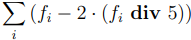

# Доход генератора блока

Доход ноды, которая добавила в блокчейн новый блок, складывается из следующих сумм:

1. Вознаграждение за генерацию блока. Текущий размер вознаграждения — 6 WAVES. Размер вознаграждения может измениться в результате голосования, см. раздел [Вознаграждение за генерацию блока](/ru/blockchain/mining/mining-reward).
2. 40% суммарной комиссии за транзакции в текущем блоке. Точное значение рассчитывается следующим образом:

   

   Здесь *fi* — комиссия за *i*-ю транзакцию. Комиссия за каждую транзакцию делится нацело на 5, затем умножается на 2, затем они суммируются.

3. 60% суммарной комиссии за транзакции в предыдущем блоке:

   

   Генератор блока получает в точности ту часть комиссии, которую не получил генератор предыдущего блока.

Если [комиссия за транзакцию](/ru/blockchain/transaction/transaction-fee) указана в спонсорском ассете, то вместо указанной в транзакции комиссии генераторы блоков получают ее эквивалент в WAVES (в соотношении 40/60 по общему правилу):

`feeInWaves` = `feeInSponsoredAsset` × 0,001 / `minSponsoredAssetFee`

`minSponsoredAssetFee` — количество спонсорского ассета, эквивалентное 0,001. Значение устанавливается спонсором ассета. Подробнее см. в разделе [Спонсирование комиссии](/ru/blockchain/waves-protocol/sponsored-fee).

Текущие правила действуют начиная с высоты 1740000, то есть с момента активации фичи №&nbsp;14 “Block Reward and Community Driven Monetary Policy”.

## Предыдущие версии

Высота 1090000–1739999

В этом диапазоне высот доход ноды состоял только из комиссий за транзакции. Правила распределения комиссии между двумя генераторами были аналогичны описанным выше. Вознаграждение за генерацию блока отсутствовало.

Правила действовали начиная с высоты 1090000 — спустя 10 000 блоков после активации фичи №&nbsp;7 “Fee Sponsorship”.

Высота 805000–1089999

Отправитель транзакции мог указать комиссию в любом ассете, и генераторы блока получали комиссию именно в этом ассете.

Генератор блока 805000 получил 40% суммарной комиссии за транзакции в этом блоке. Генераторы последующих блоков получили 40% суммарной комиссии за транзакции в текущем блоке и 60% суммарной комиссии в предыдущем блоке.

Правила действовали начиная с высоты 805000, с момента активации фичи №&nbsp;2 “NG Protocol”.

Высота 2–804999

В этом диапазоне высот генератор блока получал 100% суммарной комиссии за транзакции в текущем блоке. Отправитель мог указать комиссию в любом ассете.

