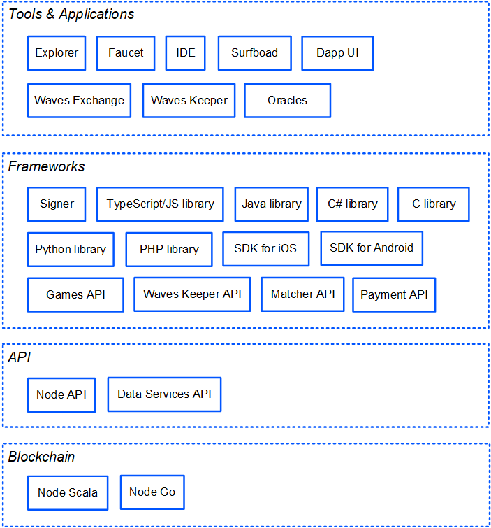

# Почему Waves

Waves — это открытый протокол блокчейна и глобальная экосистема для разработки децентрализованных приложений Web 3.0.

## Токенизация

Выпустить собственный токен на блокчейне Waves так же просто, как заполнить форму и нажать кнопку. Токен сразу же доступен для переводов между аккаунтами и обмена на бирже, это идеально подходит для краудфандинга и ICO. [Подробнее о выпуске токена](/ru/building-apps/how-to/assets/issue)

## Смарт-контракты

Для разработки смарт-контрактов Waves создан язык Ride — лаконичный и дружественный разработчику. Сложность скрипта Ride известна заранее и комиссия за выполнение предсказуема — не нужен «газ», в отличие от смарт-контрактов Ethereum. [Подробнее о Ride](/ru/ride/getting-started)

## Leased Proof of Stake

Waves использует алгоритм консенсуса Proof-of-Stake (доказательство доли владения). Шанс сгенерировать следующий блок пропорционален экономической доле участника сети. В отличие от Proof-of-Work, Proof-of-Stake не требует больших вычислительных мощностей и затрат электроэнергии, а также делает атаку на сеть невыгодной для майнеров.

Обычные пользователи могут участвовать в генерации блоков, передавая токены в WAVES в лизинг генерирующим нодам и получая часть вознаграждения. При этом средства остаются под полным контролем владельца — он может в любой момент отменить лизинг. [Подробнее о лизинге](/ru/blockchain/leasing)

## Производительность

Протокол Waves-NG позволяет проводить сотни транзакций в секунду благодаря уникальному механизму «жидких блоков», которые непрерывно увеличиваются вплоть до момента создания следующего блока. Транзакция попадает в блок в среднем через 2 секунды — поэтому приложения могут обеспечить гораздо лучший пользовательский опыт. [Подробнее о Waves-NG](/ru/blockchain/waves-protocol/waves-ng-protocol)

## Открытость

Протокол Waves является полностью открытым, все исходные коды [доступны на Github](https://github.com/wavesplatform). Обновления и развития протокола обсуждаются сообществом на форуме [Waves Enhancement Proposals](https://forum.wavesplatform.com/c/waves-improvment-proposals). Вопросы [активации новых фич](/ru/waves-node/features/) и [изменения вознаграждения](/ru/blockchain/mining/mining-reward) за генерацию блоков решаются путем голосования нод.

## Экосистема для разработчиков

Кроме самого блокчейна и лежащих в его основе протоколов, экосистема Waves предлагает множество инструментов, продуктов и компонентов, которые делают создание и запуск dApp легкими и доступными. Инструменты разработаны как командой Waves, так и сообществом.

[Приложения](/ru/ecosystem/)

[Инструменты разработки и отладки](/ru/building-apps/smart-contracts/tools/)

<!--## Спонсирование

Разработчик приложения может платить комиссию за вызов скрипта dApp вместо пользователей и тем самым снизить порог входа для них — например, сделать бесплатный пробный период. [Подробнее](/ru/blockchain/waves-protocol/sponsored-fee)-->

## Присоединяйтесь к сообществу Waves

* [Запустите собственную ноду](/ru/waves-node/) и получайте вознаграждение за генерацию блоков.
* Извлекайте прибыль от [лизинга WAVES](/en/blockchain/leasing) и [стейкинга USDN](https://neutrino.at/staking).
* [Создавайте децентрализованные приложения](/ru/building-apps/) — для игр, финансов, цифровой идентификации, цепочек поставок и любые другие.
* Пользуйтесь [приложениями на блокчейне Waves](https://www.dappocean.io/ru).