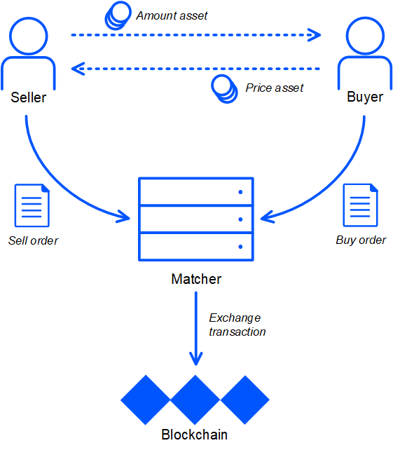
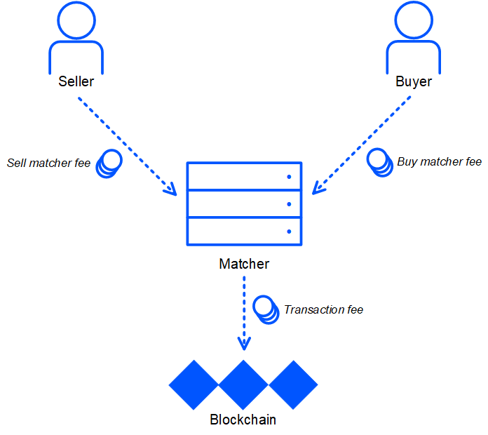

# Транзакция обмена

Транзакция обмена обменивает два различных токена между двумя аккаунтами.

Как правило, транзакция обмена создается матчером — сервисом, который исполняет биржевые ордера на покупку и продажу токенов. Матчер разработан сторонней командой из сообщества. Подробнее о матчере в [документации Waves.Exchange](https://docs.waves.exchange/ru/waves-matcher/). См. также раздел [Как купить или продать токены](/ru/building-apps/how-to/basic/trading).

Транзакция содержит два встречных ордера: ордер на покупку и ордер на продажу. Блокчейн гарантирует, что условия обмена не хуже, чем указаны в каждом из ордеров.

Ордер может быть выполнен частично. Ордер может участвовать в нескольких транзакциях обмена, с разными встречными ордерами.

Один из двух обмениваемых токенов является amount-ассетом (базовой валютой): в нем выражено количество токена в ордерах и в транзакции обмена. Другой токен является price-ассетом (валютой котировки): в нем выражена цена.



## Комиссия за транзакцию

Минимальная комиссия за транзакцию обмена — 0,003 WAVES. В случае обмена [смарт-ассета](/ru/blockchain/token/smart-asset) на обычный ассет — 0,007 WAVES, обмена двух смарт-ассетов — 0,011 WAVES.

Если отправитель транзакции — [dApp или смарт-аккаунт](/ru/blockchain/account/dapp), минимальная комиссия увеличивается на 0,004 WAVES.

## Комиссия матчера

Матчер получает комиссию за выполнение ордера с отправителя каждого ордера. Матчер устанавливает минимальный размер комиссии. Отправитель указывает в ордере комиссию не менее минимальной.

Если ордер полностью выполнен в результате транзакции обмена, матчер получает всю сумму комиссии, указанную в ордере. Если ордер выполнен частично, матчер получает часть комиссии. Блокчейн гарантирует, что суммарная комиссия матчера, полученная с отправителя ордера во всех транзакциях обмена, не превышает указанную в ордере.



## JSON-представление

```json
{
  "senderPublicKey": "9cpfKN9suPNvfeUNphzxXMjcnn974eme8ZhWUjaktzU5",
  "amount": 100000000,
  "fee": 300000,
  "type": 7,
  "version": 2,
  "sellMatcherFee": 750,
  "sender": "3PEjHv3JGjcWNpYEEkif2w8NXV4kbhnoGgu",
  "feeAssetId": null,
  "proofs": [
    "LQD8VoFhHEW2b6o2e2ujzDHdZatwMMwigC2tmoSHcFNRGXrowA1yyVxD6nZBNeABLWjs59dnuLhgNP7UMfFKDuR"
  ],
  "price": 1134500,
  "id": "EHLccXcemZPEvUpM9UkASG1GciwMt9R5B3QuYFxywj9g",
  "order2": {
    "version": 3,
    "id": "JCiF3gmprLc8u7xdWR7KUkJ3YfM6yfgxB6CvhJYGJFAa",
    "sender": "3PRBeeFD64wvTMfS3HEoDDFPXfJs3gFdAxk",
    "senderPublicKey": "ytgWVbKG9e6TSsQ5buMryr2QyxNoL3RezXP3f9RJ2As",
    "matcherPublicKey": "9cpfKN9suPNvfeUNphzxXMjcnn974eme8ZhWUjaktzU5",
    "assetPair": {
      "amountAsset": null,
      "priceAsset": "DG2xFkPdDwKUoBkzGAhQtLpSGzfXLiCYPEzeKH2Ad24p"
    },
    "orderType": "sell",
    "amount": 40000000000,
    "price": 1134500,
    "timestamp": 1591356602063,
    "expiration": 1593862202062,
    "matcherFee": 300000,
    "matcherFeeAssetId": null,
    "signature": "3D2Ngr7H6MQRs1izMQSix3dMHmDfg4bcRjxamFXFsb4Ku28neNWHdtwE6LtR3eq69Jqr1CvEsAKCWkQEeEEomcoK",
    "proofs": [
      "3D2Ngr7H6MQRs1izMQSix3dMHmDfg4bcRjxamFXFsb4Ku28neNWHdtwE6LtR3eq69Jqr1CvEsAKCWkQEeEEomcoK"
    ]
  },
  "order1": {
    "version": 3,
    "id": "FNvEGPgUqEWnrnpxevZQnaZS3DUTBGE2wa6L75xCw7mo",
    "sender": "3PDxxx7eSeYLgzTAtuAV7gUCtHeeXeU85fP",
    "senderPublicKey": "3WEkbavP3Sw4y5tsgxbZvKkWh87BdB3CPVVxhcRUDBsJ",
    "matcherPublicKey": "9cpfKN9suPNvfeUNphzxXMjcnn974eme8ZhWUjaktzU5",
      "assetPair": {
      "amountAsset": null,
      "priceAsset": "DG2xFkPdDwKUoBkzGAhQtLpSGzfXLiCYPEzeKH2Ad24p"
    },
    "orderType": "buy",
    "amount": 100000000,
    "price": 1134500,
    "timestamp": 1591356752271,
    "expiration": 1593862352271,
    "matcherFee": 300000,
    "matcherFeeAssetId": null,
    "signature": "2gvqaYy2BFbK4BJZS8taRJnhgfQ1z2CytF2RqjcyEfzFiu9tkTjN5q4UyFXpPqS3E6eD2WQBUaYCTYDKv98iW1sy",
    "proofs": [
      "2gvqaYy2BFbK4BJZS8taRJnhgfQ1z2CytF2RqjcyEfzFiu9tkTjN5q4UyFXpPqS3E6eD2WQBUaYCTYDKv98iW1sy"
    ]
  },
  "buyMatcherFee": 300000,
  "timestamp": 1591356752456,
  "height": 2093333
}
```

| Поле | Описание |
| :--- | :--- |
| amount | Количество amount-ассета. Целое число, выраженное в минимальных неделимых единицах («копейках») amount-ассета |
| price | Стоимость 1 amount-ассета, выраженная в price-ассете, умноженная на коэффициент:<br>- 10<sup>8</sup> для транзакции обмена версии 3;<br>- 10<sup>8 + priceAssetDecimals – amountAssetDecimals</sup> для транзакции обмена версии 2 или 1, где `amountAssetDecimals`, `priceAssetDecimals` — количество знаков после запятой (параметр токена) |
| buyMatcherFee | Комиссия матчера за выполнение ордера на покупку. ID токена комиссии указан в ордере на покупку |
| sellMatcherFee | Комиссия матчера за выполнение ордера на продажу. ID токена комиссии указан в ордере на продажу |
| order1, order2 | Ордер на покупку и ордер на продажу. См. раздел [Oрдер](/ru/blockchain/order) |

Описание полей, общих для всех типов транзакций, представлено в разделе [JSON-представление транзакции](/ru/blockchain/transaction/#json-представление-транзакции).

## Бинарный формат

См. раздел [Бинарный формат транзакции обмена](/ru/blockchain/binary-format/transaction-binary-format/exchange-transaction-binary-format).

## Структура Ride

Для операций с транзакцией в смарт-контрактах используется структура [ExchangeTransaction](/ru/ride/structures/transaction-structures/exchange-transaction).
