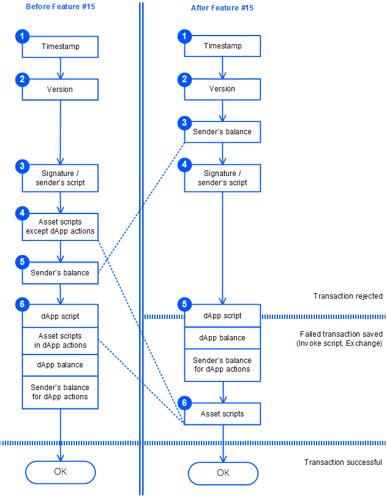

# Валидация транзакции

Каждая транзакция проходит проверку на валидность. В зависимости от результатов проверки транзакция может быть сохранена в блокчейне или отклонена.

Начиная с версии ноды 1.2.4, после активации фичи №&nbsp;15 “Ride V4, VRF, Protobuf, Failed transactions” порядок валидации транзакций изменен.

> :warning: После активации фичи №&nbsp;15 становится невозможной оплата комиссии за транзакцию вызова скрипта за счет средств, переведенных dApp-скриптом отправителю. Если баланс отправителя недостаточен для оплаты комиссии, dApp-скрипт не выполняется.

## До активации фичи № 15

1. Проверка корректности полей транзакции, в том числе:

   • Проверка временной метки: временная метка транзакции может отличаться от временной метки текущего блока не более чем на 2 часа назад или 1,5 часа вперед.

   • Проверка версии транзакции: активированы ли все фичи, необходимые для поддержки данной версии.

   • Проверка типа транзакции: активированы ли все фичи, необходимые для поддержки данного типа.

   • Проверка полей, зависящих от типа транзакции.

2. Проверка подписи транзакции для обычного аккаунта, или верификация скриптом аккаунта при отправке транзакции со [смарт-аккаунта](/ru/blockchain/account/dapp), или верификация [функцией-верификатором](/ru/ride/functions/verifier-function) при отправке с [dApp](/ru/blockchain/account/dapp). Аналогичная проверка выполняется для ордеров в транзакции обмена.

3. Верификация транзакции скриптами ассетов, если в транзакции используются [смарт-ассеты](/ru/blockchain/token/smart-asset), за исключением скриптов ассетов в [действиях dApp-скрипта](/ru/ride/structures/script-actions/), которые выполняются в&nbsp;п.&nbsp;5.
4. Проверка баланса отправителя.

   Достаточно ли средств на оплату комиссии. Если используется спонсорский ассет, проверяется также баланс спонсора.

   В зависимости от типа транзакции: достаточно ли средств для перевода и обмена ассетов, для перечисления платежей, приложенных к транзакции вызова скрипта.

5. Для транзакции вызова скрипта:

   5.1. Вычисление результата вызываемой функции dApp-скрипта.

   5.2. Верификация скриптами ассетов, если в [действиях скрипта](/ru/ride/structures/script-actions/) используются смарт-ассеты.

   5.3. Проверка баланса dApp: достаточно ли средств на выполнение действий скрипта.

   5.4. Проверка, что комиссия за транзакцию не ниже минимальной комиссии с учетом действий скрипта.

Транзакция сохраняется в блокчейне и за нее взимается комиссия, если она успешно прошла все проверки.

## После активации фичи № 15

1. Проверка корректности полей транзакции, в том числе:

   • Проверка временной метки: временная метка транзакции может отличаться от временной метки текущего блока не более чем на 2 часа назад или 1,5 часа вперед.

   • Проверка версии транзакции: активированы ли все фичи, необходимые для поддержки данной версии.

   • Проверка типа транзакции: активированы ли все фичи, необходимые для поддержки данного типа.

   • Проверка полей, зависящих от типа транзакции.

2. Проверка баланса отправителя.

   Достаточно ли средств на оплату комиссии. Если используется спонсорский ассет, проверяется также баланс спонсора.

   В зависимости от типа транзакции: достаточно ли средств для перевода и обмена ассетов, для перечисления платежей, приложенных к транзакции вызова скрипта.

3. Проверка подписи транзакции для обычного аккаунта, или верификация скриптом аккаунта при отправке транзакции со [смарт-аккаунта](/ru/blockchain/account/dapp), или верификация [функцией-верификатором](/ru/ride/functions/verifier-function) при отправке с [dApp](/ru/blockchain/account/dapp). Аналогичная проверка выполняется для ордеров в транзакции обмена.
4. Для транзакции вызова скрипта:

   4.1. Вычисление результата вызываемой функции dApp-скрипта.

   4.2. Проверка баланса dApp: достаточно ли средств на выполнение [действий скрипта](/ru/ride/structures/script-actions/).

   4.3. Проверка, что комиссия за транзакцию не ниже минимальной комиссии с учетом действий скрипта.

5. Верификация транзакции скриптами ассетов, если в транзакции используются [смарт-ассеты](/ru/blockchain/token/smart-asset), включая скрипты ассетов в действиях скрипта.

### Результат валидации

Транзакция вызова скрипта:
* Если транзакция не прошла одну из проверок 1–3, она **отклоняется**.
* Если транзакция успешно прошла проверки 1–3, а вычисление результата вызываемой функции dApp-скрипта (проверка 4.1) завершилось ошибкой или [выбрасыванием исключения](/ru/ride/exceptions) прежде, чем [сложность](/ru/ride/base-concepts/complexity) выполненных вычислений превысила [порог для сохранения неуспешных транзакций](/ru/ride/limits/), транзакция также **отклоняется**.
* Если транзакция прошла проверки 1–3, но не прошла проверки 4–5 (при этом результат вызываемой функции вычислен успешно либо сложность вычислений превысила порог), транзакция **сохраняется на блокчейне как неуспешная**: `"applicationStatus": "script_execution_failed"`. С отправителя транзакции взимается комиссия. Других изменений состояния блокчейна транзакция не влечет.
* Если транзакция прошла все проверки, она сохраняется на блокчейне как **успешная**: `"applicationStatus": "succeeded"`, за нее также взимается комиссия.

Транзакция обмена:
* Если транзакция не прошла одну из проверок 1–3, она **отклоняется**.
* Если транзакция успешно прошла проверки 1–3, но не прошла проверку 5, транзакция **сохраняется на блокчейне как неуспешная**: `"applicationStatus": "script_execution_failed"`. С отправителя транзакции (матчера) взимается комиссия. Других изменений в балансах транзакция не влечет, в частности, [комиссия матчера](/ru/blockchain/transaction-type/exchange-transaction#комиссия-матчера) с отправителей ордеров не взимается.
* Если транзакция прошла все проверки, она сохраняется на блокчейне как **успешная**: `"applicationStatus": "succeeded"`. Взимается как комиссия за транзакцию с матчера, так и комиссия с отправителей ордеров.

Транзакции остальных типов:
* Если транзакция не прошла какую-либо из проверок, она отклоняется.
* Если транзакция прошла все проверки, она сохраняется на блокчейне как успешная и за нее взимается комиссия.
