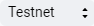
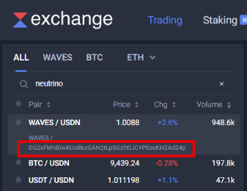

# Как прочитать данные из блокчейна

Все данные в блокчейне Waves доступны для чтения. Например, вы можете прочитать записи в хранилище данных любого аккаунта, баланс аккаунта, список транзакций аккаунта, текущую высоту и время на блокчейне.

Запрос на чтение данных вы можете отправить на собственную ноду или одну из нод с публичным API:
* Testnet: <https://nodes-testnet.wavesnodes.com>
* Mainnet: <https://nodes.wavesnodes.com>

## Записи хранилища данных аккаунта

У каждого аккаунта есть хранилище данных, которое содержит записи в формате ключ-значение. Подробнее см. в разделе [Хранилище данных аккаунта](/ru/blockchain/account/account-data-storage).

### С помощью Waves Explorer

1. Откройте <https://wavesexplorer.com/>.
2. Нажмите кнопку  и переключитесь на  или .
3. Найдите аккаунт по адресу или алиасу.
4. Перейдите на вкладку **Data**.


### С помощью Node REST API

Чтобы получить все записи из хранилища данных аккаунта, используйте метод `GET /addresses/data/{address}`.

Чтобы получить запись по ее ключу, используйте метод `GET /addresses/data/{address}/{key}`.

Описание методов см. в [Swagger](https://nodes-testnet.wavesnodes.com/).

**Пример запроса:**

```
curl 'https://nodes-testnet.wavesnodes.com/addresses/data/3N4iKL6ikwxiL7yNvWQmw7rg3wGna8uL6LU'
```

Приведенные здесь и далее примеры пригодны для использования с помощью утилиты `cURL`. Вы можете адаптировать запрос для своего языка программирования.

### С помощью JavaScript

Используйте функции библиотеки `waves-transactions`:

* функция `accountData` получает все записи из хранилища данных аккаунта, опционально для отбора записей можно использовать [регулярное выражение](https://ru.wikipedia.org/wiki/%D0%A0%D0%B5%D0%B3%D1%83%D0%BB%D1%8F%D1%80%D0%BD%D1%8B%D0%B5_%D0%B2%D1%8B%D1%80%D0%B0%D0%B6%D0%B5%D0%BD%D0%B8%D1%8F).
* функция `accountDataByKey` получает запись по ее ключу.

Описание функций см. в [документации библиотеки](https://wavesplatform.github.io/waves-transactions/modules/nodeinteraction.html) на Github.

**Пример:**

```javascript
import { nodeInteraction } from "@waves/waves-transactions";

const nodeUrl = 'https://nodes-testnet.wavesnodes.com';
const address = '3N4iKL6ikwxiL7yNvWQmw7rg3wGna8uL6LU';

let stringVal = await nodeInteraction.accountDataByKey('stringVal',address,nodeUrl);

console.log('stringVal: ' + stringVal.value);
```

### С помощью Python

```python
import requests

node_url = 'https://nodes-testnet.wavesnodes.com'
address = '3N4iKL6ikwxiL7yNvWQmw7rg3wGna8uL6LU'

account_data_storage_data = requests.get(f'{node_url}/addresses/data/{address}').json()
print(account_data_storage_data)
```

## Баланс аккаунта

Аккаунту могут принадлежать несколько ассетов (токенов) в разных количествах. Для WAVES есть четыре типа баланса: регулярный, эффективный, доступный, генерирующий. Подробнее см. в разделe [Баланс аккаунта](/ru/blockchain/account/account-balance).

### С помощью Waves Explorer

1. Откройте <https://wavesexplorer.com/>.
2. Нажмите кнопку  и переключитесь на  или .
3. Найдите аккаунт по адресу или алиасу.
4. Балансы в WAVES отображаются прямо под адресом аккаунта. Перейдите на вкладку **Assets**, чтобы увидеть балансы в других ассетах.


> Невзаимозаменяемые токены (NFT) отображаются на вкладке **Non-fungible tokens**.

### С помощью Node REST API

Чтобы получить [все типы баланса](/ru/blockchain/account/account-balance) в WAVES, используйте метод `GET /addresses/balance/details/{address}`.

Чтобы получить балансы в других ассетах, используйте метод `GET /assets/balance/{address}` или `GET /assets/balance/{address}/{assetId}`.

Описание методов см. в [Swagger](https://nodes-testnet.wavesnodes.com/).

> :bulb: Самый простой способ узнать ID ассета по названию и наоборот — посмотреть в приложении [Waves.Exchange](https://waves.exchange/), разработанном командой Waves.Exchange. Перейдите на вкладку **Торговля** и введите название или ID ассета в строке поиска.



**Пример запроса:**

```
curl 'https://nodes.wavesnodes.com/assets/balance/3P8pGyzZL9AUuFs9YRYPDV3vm73T48ptZxs/G9hT3ntXUenjCr2UwXRVa1PP6kWZtfotBLGYhfw8J7GG'
```

Вы можете адаптировать запрос для своего языка программирования.

> Чтобы получить список принадлежащих аккаунту NFT, используйте метод `GET /assets/nft/{address}/limit/{limit}`.

### С помощью JavaScript

#### Без входа в аккаунт

Используйте функции библиотеки `waves-transactions`:

* функция `balanceDetails` получает все типы баланса в WAVES.
* функция `assetBalance` получает балансы в других ассетах.

Описание функций см. в [документации библиотеки](https://wavesplatform.github.io/waves-transactions/modules/nodeinteraction.html) на Github.

**Пример:**

```javascript
import { nodeInteraction } from "@waves/waves-transactions";

const nodeUrl = 'https://nodes-testnet.wavesnodes.com';
const address = '3Mvpp7v6G11tKNgsoNhbgnZS9thdZ6TvAXK';
const assetId = 'DG2xFkPdDwKUoBkzGAhQtLpSGzfXLiCYPEzeKH2Ad24p';

let wavesBalance = await nodeInteraction.balanceDetails(address,nodeUrl);
let assetBalance = await nodeInteraction.assetBalance(assetId,address,nodeUrl);

console.log('Доступный баланс WAVES: ' + wavesBalance.available);
console.log('Эффективный баланс WAVES: ' + wavesBalance.effective);
console.log('Баланс Neutrino: ' + assetBalance.balance);
```

#### С входом в аккаунт

Если пользователь аутентифицирован в вашем приложении, вы можете использовать функции библиотеки `Signer`:

* функция `getBalance` возвращает балансы всех ассетов, принадлежащих пользователю. Для WAVES возвращается доступный баланс.
* функция `getSponsoredBalances` возвращает балансы спонсорских ассетов Подробнее о спонсировании см. в разделе [Sponsored Fee Transactions](/ru/blockchain/waves-protocol/sponsored-fee).

См. [документацию библиотеки Signer](/ru/building-apps/waves-api-and-sdk/client-libraries/signer).

**Пример:**

```javascript
import Signer from '@waves/signer';
import Provider from '@waves.exchange/provider-web';

// Инициализация библиотеки

const signer = new Signer({
  NODE_URL: 'https://nodes-testnet.wavesnodes.com'
});
signer.setProvider(new Provider());

const user = await signer.login();
let balances = await signer.getBalance();

console.log('Балансы пользователя: ' + JSON.stringify(balances));
```

### С помощью Python

```python
import requests

node_url = 'https://nodes-testnet.wavesnodes.com'
address = '3N4iKL6ikwxiL7yNvWQmw7rg3wGna8uL6LU'
asset_id = 'DG2xFkPdDwKUoBkzGAhQtLpSGzfXLiCYPEzeKH2Ad24p'

waves_balances = requests.get(f'{node_url}/addresses/balance/details/{address}').json()
print(waves_balances)

asset_balance = requests.get(f'{node_url}/assets/balance/{address}/{asset_id}').json()
print(asset_balance)
```

## Список транзакций по адресу

По адресу аккаунта вы можете получить список относящихся к нему транзакций: исходящие транзакции, отправленные с этого аккаунта; входящие переводы; сделки обмена, в которых участвовал аккаунт; вызовы dApp-скрипта и др.

### С помощью Waves Explorer

1. Откройте <https://wavesexplorer.com/>.
2. Нажмите кнопку  и переключитесь на  или .
3. Найдите аккаунт по адресу или алиасу.
4. Перейдите на вкладку **Transactions**.

### С помощью Node REST API

Чтобы получить все транзакции, относящиеся к аккаунту, используйте метод `GET /transactions/address/{address}/limit/{limit}`. Получать список можно постранично: чтобы получить следующую страницу, укажите ID последней полученной транзакции в параметре `after`.

Описание методов см. в [Swagger](https://nodes-testnet.wavesnodes.com/).

**Пример запроса:**

```
curl 'https://nodes-testnet.wavesnodes.com/transactions/address/3N1HYdheNiiTtHgi2n3jLAek6N3H4guaciG/limit/20?after=Ay5J4ZiFDVhRrLq4fdViiHHm5aiyrK3CYAN2nK6AkMA9'
```

Вы можете адаптировать запрос для своего языка программирования.

### С помощью JavaScript

Используйте функцию `fetchTransactions` библиотеки `node-api-js`.

**Пример:**

```javascript
import { create } from "@waves/node-api-js";

const nodeUrl = 'https://nodes-testnet.wavesnodes.com';
const api = create(nodeUrl);

let address = '3N1HYdheNiiTtHgi2n3jLAek6N3H4guaciG';

let txList = await api.transactions.fetchTransactions(address,10);

console.log('Transactions:' + txList.map(tx => '\nid: ' + tx.id + ' | type: ' + tx.type + ' | senderPublicKey: ' + tx.senderPublicKey));
```

### С помощью Python

```python
import requests

node_url = 'https://nodes-testnet.wavesnodes.com'
address = '3N4iKL6ikwxiL7yNvWQmw7rg3wGna8uL6LU'
limit = 10
after = '5VsNkFuEsxwaZRHezQkTsfkf7cJxjRGBiahn3H1raKsT'

transactions = requests.get(f'{node_url}/transactions/address/{address}/limit/{limit}?after={after}').json()
print(transactions)
```

## Высота блокчейна и текущее время

Высота блока — это его порядковый номер в блокчейне. Высота блокчейна — это порядковый номер последнего блока.

Вы можете использовать временную метку последнего блока как текущее время на блокчейне.

### С помощью Waves Explorer

1. Откройте <https://wavesexplorer.com/>.
2. Нажмите кнопку  и выберите  или .
3. Текущая высота отображается над списком блоков. Если вы не видите временные метки блоков, нажмите номер последнего блока.

### С помощью Node REST API

Чтобы получить только высоту блокчейна, используйте метод  `GET /blocks/height`.

Чтобы получить все заголовки последнего блока, в том числе высоту и временную метку, используйте метод `GET /blocks/headers/last`.

Описание методов см. в [Swagger](https://nodes-testnet.wavesnodes.com/).

**Пример запроса:**

```
curl 'https://nodes-testnet.wavesnodes.com/blocks/headers/last'
```

Вы можете адаптировать запрос для своего языка программирования.

> Чтобы получить блок целиком, со всеми заголовками и транзакциями, используйте метод `GET /blocks/last`.

### С помощью JavaScript

Используйте функцию `fetchHeadersLast` библиотеки `node-api-js`.

**Пример:**

```javascript
import { create } from "@waves/node-api-js";

const  nodeUrl = 'https://nodes-testnet.wavesnodes.com';
const api = create(nodeUrl);

let topBlock = await api.blocks.fetchHeadersLast();

console.log('Текущая высота: ' + topBlock.height);
console.log('Текущее время: '+ Date(topBlock.timestamp));
```

### С помощью Python

```python
import requests

node_url = 'https://nodes-testnet.wavesnodes.com'

blockchain_height = requests.get(f'{node_url}/blocks/height').json()
print(blockchain_height)

last_block_headers = requests.get(f'{node_url}/blocks/headers/last').json()
print(last_block_headers)
```
