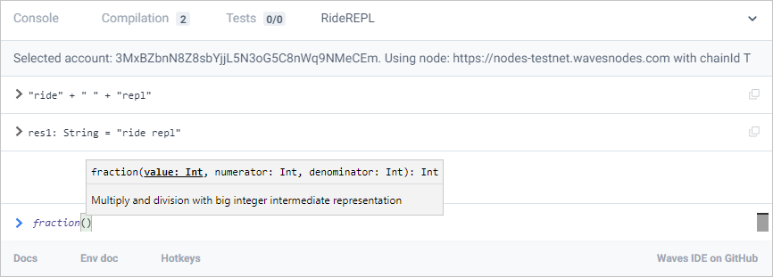

# Ride REPL: интерактивная консоль Ride

В консоли Ride [REPL (от read-eval-print loop)](https://ru.wikipedia.org/wiki/REPL) можно ввести любое выражение на языке Ride и сразу увидеть результат. 



REPL встроен в инструменты разработки:

* [Waves IDE](/ru/building-apps/smart-contracts/tools/waves-ide#repl-интерактивная-консоль-ride)
* [Расширение для Visual Studio Code](/ru/building-apps/smart-contracts/tools/ride-vscode#repl-интерактивная-консоль-ride)
* [Surfboard](/ru/building-apps/smart-contracts/tools/surfboard#repl-интерактивная-консоль-ride)

В Ride REPL можно объявлять переменные, функции, а также использовать результаты предыдущих вычислений:

```
RIDE > let x =42
defined let x: Int
RIDE > func inc(i:Int) = { i + 1 }
defined func inc(i: Int): Int
RIDE > inc(x)
res1: Int = 43
RIDE > inc(res1)
res2: Int = 44
```

Команда `:reset` сбрасывает все предыдущие объявления и результаты.

## Стандартная библиотека

REPL поддерживает [встроенные переменные](/ru/ride/variables/built-in-variables), [функции](/ru/ride/functions/built-in-functions/) и [операторы](/ru/ride/operators) Ride:

```
RIDE > max([2,12,85,6])
res3: Int = 85
RIDE > sha256(base58'')
res4: ByteVector = base58'GKot5hBsd81kMupNCXHaqbhv3huEbxAFMLnpcX2hniwn')
```

Получить сигнатуру любой функции, определение типа данных или тип переменной можно с помощью команды `?`

```
RIDE > ? getInteger
func getInteger(addressOrAlias: Address|Alias, key: String): Int|Unit
func getInteger(data: List[DataEntry], key: String): Int|Unit
func getInteger(data: List[DataEntry], index: Int): Int|Unit
```

Команда `??` выводит все описания.

## Данные блокчейна

Результаты выполнения некоторых функций и значения встроенных переменных зависят от текущих настроек для работы с блокчейном: аккаунта и выбранной сети (Mainnet, Testnet или другая).

```
RIDE > this
res5: Address = Address(
        bytes = base58'3N3ErpmUdJWy6DW4ruAr14YDis9UaiTwHd6'
)
RIDE > wavesBalance(this)
res6: BalanceDetails = BalanceDetails(
    available = 8978000000
    regular = 8978000000
    generating = 8978000000
    effective = 8978000000
)
```

:bulb: Команда `.editor` активирует многострочный режим, в котором можно ввести сразу несколько определений или вставить большой блок кода.


**REPL** ([_read–eval–print loop_](https://en.wikipedia.org/wiki/Read%E2%80%93eval%E2%80%93print_loop)) — консоль [Waves IDE](/ru/building-apps/smart-contracts/tools/waves-ide).


В консоли можно писать любой код на JavaScript.

В консоли есть встроенные функции, с помощью которых можно:

* подписывать и отправлять [транзакции](/ru/blockchain/transaction/)
* получать баланс аккаунта
* читать данные из [хранилища данных аккаунта](/ru/blockchain/account/account-data-storage)

Документация по функциям консоли доступна на [GitHub](https://wavesplatform.github.io/js-test-env/).
