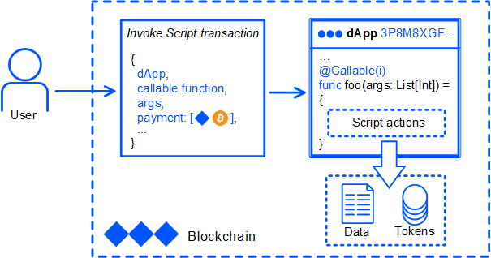
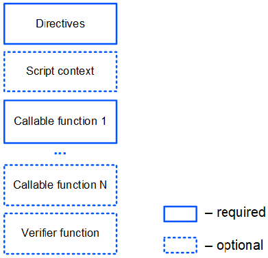

# Что такое dApp

dApp — это аккаунт Waves с установленным dApp-скриптом.

dApp-скрипт представляет собой код на языке Ride. Он содержит вызываемые (сallable) функции, которые могут быть вызваны извне путем отправки [транзакции вызова скрипта](/ru/blockchain/transaction-type/invoke-script-transaction).

Транзакция вызова скрипта содержит:

* адрес dApp;
* имя вызываемой функции и значения аргументов;
* дополнительно транзакция вызова может содержать платежи, которые будут зачислены на баланс dApp.

[Пример транзакции вызова скрипта](https://nodes.wavesnodes.com/transactions/info/7CVjf5KGRRYj6UyTC2Etuu4cUxx9qQnCJox8vw9Gy9yq)

Результатом выполнения вызываемой функции могут быть:

* добавление, редактирование, изменение записей в [хранилище данных аккаунта](/ru/blockchain/account/account-data-storage) dApp;
* переводы средств;
* выпуск, довыпуск, сжигание токенов;
* настройка спонсирования.

> Набор доступных действий скрипта зависит от версии [Стандартной библиотеки](/ru/ride/script/standard-library).



## Структура dApp-скрипта

dApp-скрипт содержит одну или несколько вызываемых функций.

Кроме того, dApp-скрипт может содержать функцию-верификатор, которая проверяет транзакции и ордера, отправляемые с аккаунта dApp.



### Директивы

Каждый скрипт Ride должен начинаться с директив. Для dApp набор директив следующий:

```ride
{-# STDLIB_VERSION 3 #-}
{-# CONTENT_TYPE DAPP #-}
{-# SCRIPT_TYPE ACCOUNT #-}
```

Приведенные директивы сообщают компилятору, что:

- в скрипте будет использоваться Стандартная библиотека версии 3;
- тип скрипта — dApp;
- скрипт будет привязан к аккаунту (а не к ассету).

### Контекст скрипта

Контекст скрипта включает [встроенные переменные](/ru/ride/variables/built-in-variables) и [встроенные функции](/ru/ride/functions/built-in-functions/). Кроме того, между директивами и вызываемой функцией можно объявить собственные переменные и вспомогательные функции, которые будут доступны в пределах всего dApp.

Пример:

```
let someConstant = 42
func doSomething() = {
    1+1
}
```

### Вызываемые функции

Вызываемая функция может быть вызвана извне при помощи транзакции вызова скрипта. Такая функция помечается аннотацией `@Callable(i)`, где `i` — структура [Invocation](/ru/ride/structures/common-structures/invocation), которая содержит поля транзакции вызова скрипта, доступные вызываемой функции.

Результат выполнения вызываемой функции — набор [действий скрипта](/ru/ride/structures/script-actions/), которые будут выполнены на блокчейне: добавление записей в хранилище данных аккаунта, переводы токенов и др. Формат результата и доступные действия зависят от версии Стандартной библиотеки.

Подробное описание приведено в разделе [Вызываемая функция](/ru/ride/functions/callable-function).

Ниже приведен пример вызываемой функции, которая переводит вызвавшему ее аккаунту 1 WAVES и записывает информацию об этом в хранилище данных аккаунта. Если тот же аккаунт снова пытается вызвать функцию, она не делает ничего.

```ride
@Callable(i)
func faucet () = {
    let isKnownCaller =  match getBoolean(this, toBase58String(i.caller.bytes)) {
        case hist: Boolean =>
            hist
        case _ =>
            false
    }
    if (!isKnownCaller) then 
        ScriptResult(
           WriteSet([DataEntry(toBase58String(i.caller.bytes), true)]),
           TransferSet([ScriptTransfer(i.caller, 100000000, unit)])
        )
    else WriteSet([])
}
```

### Функция-верификатор

Функция-верификатор проверяет транзакции и ордера, отправляемые с аккаунта dApp (то есть работает аналогично скрипту аккаунта). Эта функция помечается аннотацией `@Verifier(tx)`, где `tx` — текущая проверяемая транзакция или ордер.

Подробное описание приведено в разделе [Функция-верификатор](/ru/ride/functions/verifier-function).

Ниже приведен пример функции-верификатора, которая разрешает только [транзакции перевода](/ru/blockchain/transaction-type/transfer-transaction): отправка транзакций другого типа и ордеров запрещена. Задать правила верификации в зависимости от типа транзакции (или ордера) можно с помощью оператора [match](/ru/ride/operators/match-case).

```ride
@Verifier(tx)
func verify() = {
    match tx {
        case ttx:TransferTransaction => sigVerify(ttx.bodyBytes, ttx.proofs[0], ttx.senderPublicKey)
        case _ => false
    }
}
```

Если в dApp нет функции верификации, то выполняется верификация по умолчанию, то есть проверка, что транзакция или ордер действительно подписаны этим аккаунтом.

## Данные, к которым имеет доступ dApp

dApp может использовать данные блокчейна:

* Записи в хранилищах данных аккаунтов (как аккаунта самого dApp, так и любых других).
* Балансы аккаунтов.
* Параметры ассетов.
* Высота блокчейна.
* Заголовки блоков.
* Транзакции перевода (по идентификатору транзакции).

См. разделы [Функции хранилища данных аккаунта](/ru/ride/functions/built-in-functions/account-data-storage-functions) и [Функции блокчейна](/ru/ride/functions/built-in-functions/blockchain-functions).

Кроме того:

* Вызываемая функция имеет доступ к полям транзакции, которая вызвала dApp-скрипт. Cм. раздел [Invocation](/ru/ride/structures/common-structures/invocation).
* Функция-верификатор имеет доступ к полям транзакции или ордера, отправляемых с аккаунта dApp, включая [подтверждения (proofs)](/ru/blockchain/transaction/transaction-proof).

## Установка dApp-скрипта

Чтобы прикрепить dApp к аккаунту, отправьте с этого аккаунта [транзакцию установки скрипта](/ru/blockchain/transaction-type/set-script-transaction).

Отправить транзакцию установки скрипта можно:
* В [Waves IDE](https://waves-ide.com/): создайте или импортируйте аккаунт, откройте dApp-скрипт и нажмите **Deploy**.
* С помощью одной из [клиентских библиотек](/ru/building-apps/waves-api-and-sdk/client-libraries/). См. также примеры в разделе [Создание и отправка транзакций](/ru/building-apps/how-to/basic/transaction).

[Пример транзакции](https://wavesexplorer.com/testnet/tx/213JdqCLq6qGLUvoXkMaSA2wLSwdzH24BuhHBhcBeHUR)

Комиссия за транзакцию установки скрипта — 0,01 WAVES.

После установки скрипта минимальная комиссия за транзакцию, отправленную с аккаунта dApp, увеличивается на 0,004 WAVES.

## Ограничения

Ограничения на размер, сложность скрипта, а также на функции и переменные приведены в разделе [Ограничения](/ru/ride/limits/).

## Примеры

Примеры dApp-скриптов можно найти:

* В разделе [Практические руководства](/ru/building-apps/how-to#dapps).
* В [Waves IDE](https://waves-ide.com/) в меню **Library**.
* На Github в репозитории [ride-examples](https://github.com/wavesplatform/ride-examples/blob/master/welcome.md).

Руководство по созданию dApp приведено в разделе [Создание и запуск dApp](/ru/building-apps/smart-contracts/writing-dapps).
