# Начало работы с Waves Keeper

## Введение

Waves Keeper позволяет надежно хранить ключи аккаунта Waves при безопасном взаимодействии со сторонними веб-ресурсами. Это разновидность простой аутентификации и единого входа для веб-приложений с поддержкой dApp или Waves, которая позволяет подписывать транзакции без ввода личного ключа или пароля.

Seed-фразы и закрытые ключи зашифрованы и хранятся в расширении, dApp и сервисы не могут получить к ним доступ, что дает вам уверенность в том, что ваши средства всегда защищены от хакеров и вредоносных сайтов. Выполнение транзакции не требует ввода конфиденциальной информации.

Waves Keeper создан для удобства, чтобы можно было подписывать транзакции всего парой кликов и легко переключаться между несколькими кошельками. Если вы забудете пароль учетной записи, вы сможете восстановить доступ с помощью seed-фразы. С Waves Keeper вы всегда можете быть спокойны за сохранность своих активов и подтверждать исходящие транзакции со своего аккаунта Waves.

## Начало работы

[Загрузите](/ru/waves-keeper/) и установите Waves Keeper, затем нажмите **Get Started**.

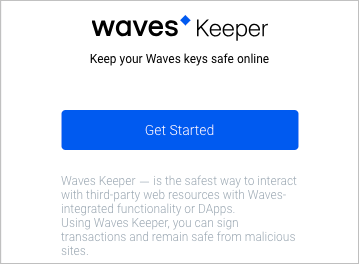

Прочитайте условия и положения и нажмите **Accept**.

Появится следующее всплывающее окно.
Защитите свой аккаунт паролем.

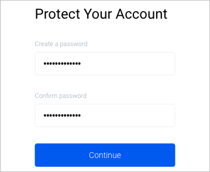

Заданный пароль будет храниться локально. Если вы меняете устройство или теряете пароль, вам придется повторить процесс добавления учетных записей в Waves Keeper. Блокчейн Waves не хранит ваши пароли.

После ввода пароля и подтверждения нажмите **Continue**.

Появится следующее всплывающее окно.
Теперь вам нужно создать новую учетную запись или импортировать существующую учетную запись.

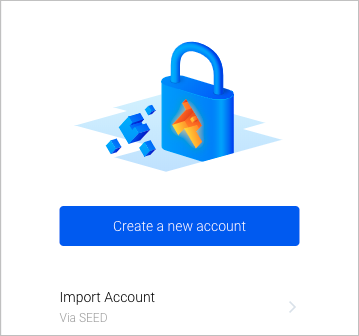

## Как создать новый аккаунт

Нажмите **Create a New Account**. Выберите аватар аккаунта и нажмите **Continue**.

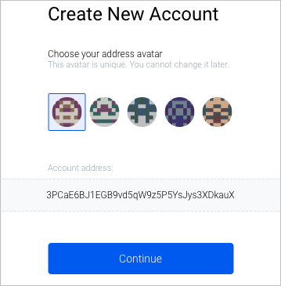

Введите имя аккаунта и нажмите **Create backup**.

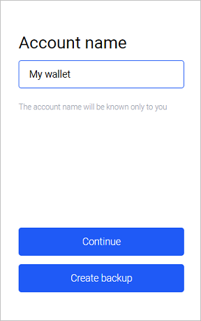

Пожалуйста, запишите эти 15 слов (SEED фразу) на бумаге или скопируйте их, чтобы вставить и сохранить в текстовом файле. После этого нажмите **Continue**.

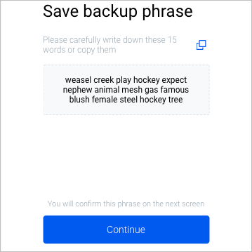

Подтвердите SEED фразу, разместив слова в правильном порядке и нажмите **Confirm**.

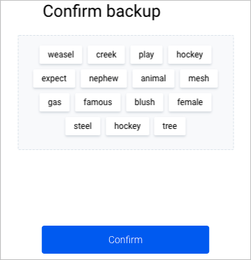

После этого вы увидите главную страницу Keeper.

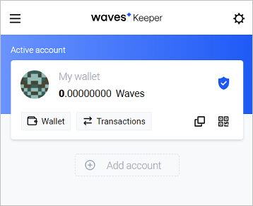

Здесь вы можете **скопировать адрес**, отсканировать **QR**-код, который содержит ваш адрес Waves, или найти личные данные вашей учетной записи, нажав на значок .

## Как импортировать существующий аккаунт в Waves Keeper

Откройте Waves Keeper и нажмите **Add Account → Import Account**.

Введите SEED фразу в поле **Wallet Seed**. Проверьте сгенерированный адрес Waves. Если всё верно, нажмите **Import Account**.

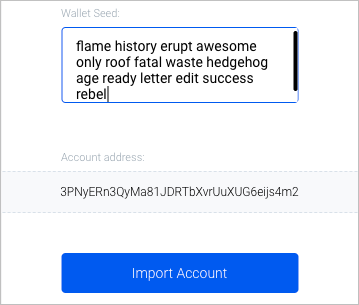

Введите имя аккаунта и нажмите **Continue**.

После этого вы увидите главную страницу Keeper.

Здесь вы можете **скопировать адрес**, отсканировать **QR**-код, который содержит ваш адрес Waves, или найти личные данные вашей учетной записи, нажав на значок .

## Как использовать контроль разрешений

Функция контроля разрешений позволяет на определённое время активировать автоматическую подпись запросов от веб-сайтов из белого списка.

Откройте любой ресурс, который поддерживает авторизацию, с помощью Waves Keeper, например, [LiquidWave](https://liquidwave.io/).

На странице ресурса нажмите **Authorize with Waves Client**. Появится окно с запросом от Waves Keeper.

Вы можете разрешить одноразовый запрос или настроить **Permission details**, если вы планируете выполнять несколько операций. Для этого выберите время в поле **Resolution time** и максимальную сумму расходов в поле **Spending limit**.

Для завершения процесса верификации нажмите **Auth**.

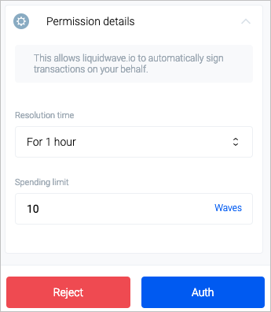

Чтобы изменить разрешения, откройте настройки Keeper, нажав кнопку  в правом верхнем углу.

После этого вы увидите страницу **Settings**. Нажмите **Permissions control** и выберите **Custom list** для редактирования списка вручную или **White list**, чтобы редактировать основной список с официальными ресурсами.

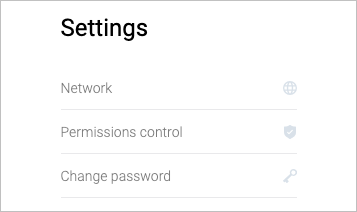

Чтобы изменить настройки, нажмите **Settings** рядом с требуемым ресурсом.

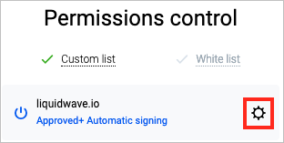

Откроется меню **Permission details**.

Выберите **Resolution time** и максимальную сумму расходов в поле **Spending limit**. Нажмите **Save**, чтобы сохранить, или **Delete**, чтобы удалить ресурс.

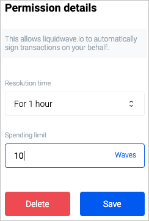

Чтобы редактировать ресурсы из **White list**, следуйте той же логике:

Выберите **Resolution time** и максимальную сумму расходов в поле **Spending limit**. Нажмите **Save**.

**Note**: Удаление официальных ресурсов невозможно.
