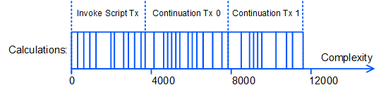
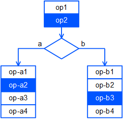

# Вычисления с продолжением

Если сложность dApp-скрипта превышает 4000, его выполнение разбивается на несколько этапов. Добавляя в блок транзакцию вызова скрипта, генератор блока нода выполняет вычисления, суммарная сложность которых не превышает 4000, и сохраняет промежуточные результаты во внутренней базе данных. Далее генератор блока — тот же самый или другой, если уже появился новый блок — обнаруживает незавершенную цепочку вычислений, создает транзакцию продолжения и добавляет ее в блок, выполняя следующую порцию вычислений. Процесс продолжается, пока скрипт не будет выполнен полностью или не завершится ошибкой.

Таким образом, первый этап вычислений выполняется в рамках транзакции вызова скрипта, последующие этапы — в рамках транзакций продолжения, создаваемых автоматически генераторами блоков. Описание транзакции продолжения см. в разделе [Транзакция продолжения](/ru/blockchain/transaction-type/continuation-transaction).

## Условия

* Возможность выполнения скрипта с продолжением доступна начиная с версии ноды 1.3.0 после активации фичи №&nbsp;16 “Continuations”. Версии 1.3.x в настоящее время доступны только на [Stagenet](/ru/blockchain/blockchain-network/).
* dApp-cкрипт использует [Стандартную библиотеку](/ru/ride/script/standard-library) **версии 5**.
* [Транзакция вызова скрипта](/ru/blockchain/transaction) имеет версию 3.

> Вычисления с продолжением и вызов dApp из dApp несовместимы, то есть не могут быть инициированы одной и той же транзакцией.

## Приостановка других транзакций с участием dApp

Пока цепочка вычислений не завершена, те транзакции, которые могут уменьшить баланс dApp, могут быть добавлены в [UTX pool](/ru/blockchain/transaction/#utx-pool), но не могут быть добавлены в блок:

* Транзакции, отправителем которых является dApp.
* Транзакции вызова скрипта того же dApp.
* Транзакции обмена, в которых отправителем одного из ордеров является dApp.
* Транзакции с комиссией в спонсорском ассете, выпущенном dApp.

При этом любые переводы в пользу dApp, лизинги в пользу dApp и отмены таких лизингов разрешены.

## Данные блокчейна при выполнении скрипта

На всех этапах вычислений скрипт dApp оперирует одними и теми же данными блокчейна.

### 1. Записи в собственном хранилище данных dApp

Благодаря приостановке других транзакций с участием dApp (см. выше) записи в хранилище данных dApp не меняются с момента начала выполнения скрипта и до завершения. Скрипт dApp может получить данные из собственного хранилища на любом этапе вычислений, то есть в любой из транзакций цепочки вычислений, с помощью следующих функций:

| Название | Описание |
| :--- | :--- |
| getBinary(key: String): ByteVector&#124;Unit | Получает значение бинарной записи по ключу |
| getBinaryValue(key: String): ByteVector | Получает значение бинарной записи по ключу; завершается ошибкой, если запись отсутствует |
| getBoolean(key: String): Boolean&#124;Unit | Получает значение логической записи по ключу |
| getBooleanValue(key: String): Boolean | Получает значение логической записи по ключу; завершается ошибкой, если запись отсутствует |
| getInteger(key: String): Int&#124;Unit | Получает значение целочисленной записи по ключу |
| getIntegerValue(key: String): Int | Получает значение целочисленной записи по ключу; завершается ошибкой, если запись отсутствует |
| getString(key: String): String&#124;Unit | Получает значение строковой записи по ключу |
| getStringValue(key: String): String | Получает значение строковой записи по ключу; завершается ошибкой, если запись отсутствует |

Описание функций см. в разделе [Функции хранилища данных аккаунта](/ru/ride/functions/built-in-functions/account-data-storage-functions).

### 2. Внешние данные блокчейна

К внешним данным относятся все данные блокчейна, кроме записей в собственном хранилище данных dApp, в том числе:

* Записи в хранилищах данных других аккаунтов.
* Балансы аккаунтов, в том числе аккаунта самого dApp.
* Текущая высота блокчейна.
* Параметры ассетов, заголовки блоков, транзакции и др.

Все внешние данные блокчейна, используемые скриптом dApp, должны быть получены на первом этапе вычислений, то есть в исходной транзакции вызова скрипта. Благодаря этому вычисления всех этапов проводятся с одними и теми же данными.

Cложность части скрипта от начала и до последней функции чтения внешних данных включительно не должна превышать 4000.

Если скрипт содержит ветвления, заранее неизвестно, какая из веток будет выполнена. Поэтому учитывается суммарная сложность по всем веткам. Рассмотрим следующую схему:

Если операции `op2`, `op-a2` и `op-b3` читают внешние данные блокчейна, то общая сложность операций
`op1 + op2 + op-a1 + op-a2 + op-b1 + op-b2 + op-b3` не должна превышать 4000, иначе dApp-скрипт не может быть установлен (транзакция вызова скрипта будет отклонена).

## Комиссии

Отправитель должен учесть в комиссии максимально возможное количество этапов вычислений и действий скрипта.

Минимальная комиссия в WAVES, которую должен указать отправитель в транзакции вызова скрипта, рассчитывается по формуле:

`Fee` = (0,005 + `E`) × ⌈`С` / 4000⌉ × + `S` + 0,004 × `P` + 0,004 × `A` + 1 × `I`,

где:

   `E` (extra) — надбавка к комиссии за каждый этап вычислений. Отправитель указывает надбавку в поле `extraFeePerStep`. Надбавка может быть равна 0. Надбавка больше 0 предназначена для повышения приоритета обработки транзакции.

   `C` (complexity) — сложность скрипта, `С` / 4000 с округлением вверх до ближайшего целого — количество этапов вычислений,

   `S` (sender) = 0,004, если отправитель транзакции —  [dApp или смарт-аккаунт](/ru/blockchain/account/dapp), и 0 в ином случае,

   `P` (payment) — количество платежей в [смарт-ассетах](/ru/blockchain/token/smart-asset),

   `A` (action) — количество действий скрипта (переводов, довыпусков, сжиганий) со смарт-ассетами,

   `I` (issue) — количество выпущенных скриптом токенов, не являющихся [NFT](/ru/blockchain/token/non-fungible-token).

Вся сумма комиссии, указанная в транзакции, взимается с отправителя при добавлении транзакции вызова скрипта в блок. Если комиссия указана в спонсорском ассете, со спонсора взимается эквивалент комиссии в WAVES.

Комиссия за выполнение транзакций распределяется следующим образом:

1. За транзакцию вызова скрипта: 0,005 + `E` + `S` + 0,004 × `P`.
2. За каждую транзакцию продолжения, кроме последней: 0,005 + `E`.
3. За последнюю транзакцию продолжения: 0,005 + `E` + 0,004 × `A` + 1 × `I`.

(В соответствии с протоколом [Waves-NG](/ru/blockchain/waves-protocol/waves-ng-protocol) 40% комиссии получает генератор блока, в который добавлена транзакция, и 60% комиссии — генератор следующего блока.)

После завершения вычислений неиспользованная часть комиссии (за этапы и скрипты ассета, выполнение которых не началось; см. пример ниже) возвращается отправителю. Если комиссия указана в спонсорском ассете, спонсору возвращается эквивалент этой части комиссии в WAVES.

> [Порог для сохранения неуспешных транзакций](/ru/ride/limits/) действует только для транзакции вызова скрипта. Если вычисления завершились ошибкой или [выбрасыванием исключения](/ru/ride/exceptions) в рамках транзакции продолжения, она сохраняется на блокчейне как неуспешная и за нее взимается комиссия.

**Рассмотрим пример:**
* Сложность вызываемой функции `C` = 10&nbsp;000.
* Отправитель транзакции — смарт-аккаунт: `S` = 0.004.
* Отправитель транзакции указал надбавку `extraFeePerStep`: `E` = 0,002.
* Транзакция содержит 2 платежа в смарт-ассете: `P` = 2.
* Вызываемая функция выполняет 3 перевода смарт-ассета, а также выпуск токена: `A` = 3 and `I` = 1.

Минимальная комиссия за транзакцию вызова скрипта (0,005 + 0,002) × 3 + 0,004 + 0,004 × 2 + 0,004 × 3 + 1 = 1,045 WAVES. Если все транзакции будут выполнены успешно, комиссия будет распределена следующим образом:
* за транзакцию вызова скрипта 0,005 + 0,002 + 0,004 + 0,004 × 2,
* за первую транзакцию продолжения 0,005 + 0,002,
* за вторую транзакцию продолжения 0,005 + 0,002 + 0,004 × 3 + 1 × 1.

> Если отправитель транзакции указал комиссию больше минимальной 1,045 WAVES, остаток будет ему возвращен, даже если все этапы успешно завершены.

Если транзакция вызова скрипта завершится ошибкой (притом что сложность выполненных вычислений превысит порог сохранения неуспешных транзакций):
* Если выполнение вызываемой функции завершится ошибкой, отправитель заплатит 0,005 + 0,002 + 0,004 = 0,011 WAVES. Остаток 1,034 WAVES будет ему возвращен.
* Если выполнены все операции вызываемой функции в пределах сложности 4000, но один из скриптов ассетов отклонил транзакцию, отправитель также заплатит 0,004 WAVES за каждый скрипт ассета, который был фактически выполнен. Например, если первый скрипт ассета вернул `false` или завершился ошибкой, а выполнение второго не началось, то отправитель заплатит 0,005 + 0,002 + 0,004 + 0,004 × 1 = 0,015 WAVES. Неиспользованный остаток 1,030 WAVES будет ему возвращен.

Если первая транзакция продолжения завершится ошибкой, отправитель заплатит (0,005 + 0,002) × 2 + 0,004 + 0,004 × 2 = 0,026 WAVES. Остаток 1,019 WAVES будет ему возвращен.

Если последняя транзакция продолжения завершится ошибкой:
* Если выполнение вызываемой функции завершится ошибкой, отправитель заплатит (0,005 + 0,002) × 3 + 0,004 + 0,004 × 2 = 0,033 WAVES. Остаток 1,012 WAVES будет ему возвращен.
* Если результат вызываемой функции вычислен успешно, но один из скриптов ассета отклонил транзакцию, отправитель заплатит 0,004 WAVES за каждый скрипт ассета, который был фактически выполнен. Например, если первый скрипт ассета в переводах вернул `true`, второй вернул `false` или завершился ошибкой, а выполнение третьего не началось, то отправитель заплатит (0,005 + 0,002) × 3 + 0,004 + 0,004 × 2 + 0,004 × 2 = 0,041 WAVES. Неиспользованный остаток 1,004 WAVES будет ему возвращен.

## Статус выполнения транзакции

Поле `applicationStatus` в JSON-представлении транзакции содержит статус выполнения вычислений:

* `succeeded`: транзакция успешна.
* `script_execution_failed`: результат выполнения dApp-скрипта или скрипта ассета был неудачным.
* `script_execution_in_progress`: цепочка вычислений еще не завершена (промежуточный статус).

REST API ноды возвращает одинаковый статус выполнения для всех транзакций в цепочке вычислений. Когда скрипт  полностью выполнен или завершился ошибкой, все транзакции в цепочке получают статус `succeeded` или `script_execution_failed` соответственно.
