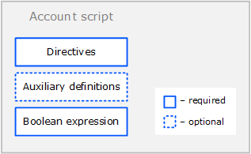

# Скрипт аккаунта

Скрипт аккаунта позволяет верифицировать транзакции и ордера, отправляемые от имени аккаунта, то есть разрешать или запрещать транзакцию или ордер в зависимости от выполнения заданных условий.

Аккаунт с прикрепленным к нему скриптом называется смарт-аккаунтом. О создании и использовании смарт-аккаунтов читайте в разделе [Смарт-аккаунт](/ru/building-apps/smart-contracts/what-is-smart-asset).

## Формат скрипта аккаунта



### Директивы

Скрипт аккаунта начинается с директив:

```scala
{-# STDLIB_VERSION 4 #-}
{-# CONTENT_TYPE EXPRESSION #-}
{-# SCRIPT_TYPE ACCOUNT #-}
```

Приведенные директивы сообщают компилятору, что:

- в скрипте будет использоваться Стандартная библиотека версии 4;
- скрипт содержит логическое выражение;
- скрипт будет привязан к аккаунту (не к ассету).

### Вспомогательные определения

После директив можно объявить вспомогательные переменные и функции.

Пример:

```scala
let someConstant = 42
func doSomething() = {
    height + someConstant
}
```

### Логическое выражение

Выражение проверяет отправляемые от имени аккаунта транзакции и ордера на соответствие заданным условиям. Если условия не соблюдаются, транзакция (ордер) будет отклонена. Возможными результатами вычисления выражения являются:
* true — транзакция/ордер разрешена,
* false — транзакция/ордер отклонена,
* ошибка — транзакция/ордер отклонена.

С помощью оператора [match ... case](/ru/ride/operators/match-case) можно настроить разные условия в зависимости от типа транзакции/ордера. Например, следующее выражение запрещает отправку ордеров и изменение скрипта аккаунта, а остальные транзакции разрешает при условии, что массив подтверждений (`proofs`) содержит корректную подпись аккаунта на позиции 0:

```scala
match tx {
  case t : Order|SetScriptTransaction => false
  case _ => sigVerify(tx.bodyBytes, tx.proofs[0], tx.senderPublicKey)
}
```

## Данные, доступные скрипту аккаунта

Для проверок могут быть использованы следующие параметры:

* Поля текущей верифицируемой транзакции/ордера, в том числе подтверждения (`proofs`). Встроенная переменная `tx` содержит эту транзакцию или ордер. Набор полей зависит от типа транзакции/ордера, см. разделы [Структуры транзакций](/ru/ride/structures/transaction-structures/), [Order](/ru/ride/structures/common-structures/order).
* [Данные блокчейна](/ru/ride/#работа-с-бокчейном): текущая высота, балансы аккаунтов, записи в хранилищах данных аккаунтов, параметры токенов и др.

   :warning: Данные блокчейна доступны только при проверке транзакции и недоступны при проверке ордера (`case t: Order`).

## Примеры

Примеры скриптов аккаунтов можно найти:
* в разделе [Смарт-аккаунт](/ru/building-apps/smart-contracts/what-is-smart-account);
* в [Waves IDE](/ru/building-apps/smart-contracts/tools/waves-ide): **Library → smart-accounts**.
