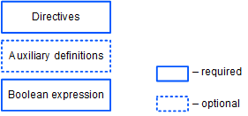

# Скрипт ассета

Скрипт ассета позволяет верифицировать транзакции с участием [ассета (токена)](/ru/blockchain/token/), то есть разрешать или запрещать транзакцию в зависимости от выполнения заданных условий.

:warning: Обратите внимание: скрипт ассета может верифицировать только транзакции, но не ордера.

Ассет с прикрепленным к нему скриптом называется смарт-ассетом. О создании и использовании смарт-ассетов читайте в разделе [Смарт-ассет](/ru/building-apps/smart-contracts/what-is-smart-asset).

## Формат скрипта ассета



### Директивы

Скрипт ассета начинается с [директив](/ru/ride/script/directives):

```scala
{-# STDLIB_VERSION 4 #-}
{-# CONTENT_TYPE EXPRESSION #-}
{-# SCRIPT_TYPE ASSET #-}
```

Приведенные директивы сообщают компилятору, что:

- в скрипте используется Стандартная библиотека версии 4;
- скрипт завершается логическим выражением;
- скрипт будет привязан к ассету.

### Вспомогательные определения

После директив можно определить вспомогательные переменные и функции.

Пример:

```scala
let someConstant = 42
func doSomething() = {
    height + someConstant
}
```

### Логическое выражение

Выражение проверяет транзакции с участием ассета на соответствие заданным условиям. Если условия не соблюдаются, транзакция будет отклонена. Возможными результатами вычисления выражения являются:
* true — транзакция разрешена,
* false — транзакция отклонена,
* ошибка — транзакция отклонена.

С помощью оператора [match ... case](/ru/ride/operators/match-case) можно настроить разные условия в зависимости от типа транзакции. Например, следующее выражение запрещает изменение скрипта ассета и разрешает остальные транзакции:

```scala
match tx {
  case t : SetAssetScriptTransaction => false
  case _ => true
}
```

## Неуспешные транзакции

Если скрипт ассета отклонил [транзакцию обмена](/ru/blockchain/transaction-type/exchange-transaction) (при условии что она прошла проверку подписи отправителя или проверку скриптом аккаунта), она сохраняется на блокчейне с атрибутом `"applicationStatus": "script_execution_failed"`. С отправителя транзакции (матчера) взимается комиссия. Других изменений в балансах транзакция не влечет, в частности, комиссия матчера с отправителей ордеров не взимается.

Если скрипт ассета отклонил [транзакцию вызова скрипта](/ru/blockchain/transaction-type/invoke-script-transaction) (при условии что она прошла проверку подписи отправителя или проверку скриптом аккаунта, а сложность вычислений, выполненных dApp-скриптом, превысила [порог для сохранения неуспешных транзакций](/ru/ride/limits/)), она сохраняется на блокчейне с атрибутом `"applicationStatus": "script_execution_failed"`. С отправителя транзакции взимается комиссия. Других изменений не блокчейне транзакция не влечет.

[Подробнее о валидации транзакций](/ru/blockchain/transaction/transaction-validation)
[Подробнее о работе с неуспешными транзакциями](/ru/keep-in-touch/april)


## Данные, доступные скрипту ассета

Для проверок могут быть использованы следующие параметры:

* Данные блокчейна: высота, балансы аккаунтов, записи в хранилищах данных аккаунтов, параметры токенов и др. См. разделы [Функции хранилища данных аккаунта](/ru/ride/functions/built-in-functions/account-data-storage-functions) и [Функции блокчейна](/ru/ride/functions/built-in-functions/blockchain-functions).
* Поля текущей верифицируемой транзакции, за исключением подтверждений (`proofs`). Встроенная переменная `tx` содержит эту транзакцию. Набор полей зависит от типа транзакции, см. разделы [Структуры транзакций](/ru/ride/structures/transaction-structures/).

## Примеры

Примеры скриптов ассетов можно найти:
* в разделе [Смарт-ассет](/ru/building-apps/smart-contracts/what-is-smart-asset);
* в [Waves IDE](/ru/building-apps/smart-contracts/tools/waves-ide): **Library → smart-assets**.
