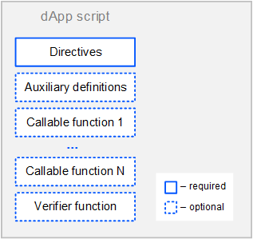

# dApp-скрипт

dApp-скрипт позволяет определить вызываемые (сallable) функции, которые могут быть вызваны с других аккаунтов путем отправки [транзакции вызова скрипта](/ru/blockchain/transaction-type/invoke-script-transaction). Вызываемые функции могут принимать платежи в пользу dApp и выполнять различные действия на блокчейне. Кроме того, dApp-скрипт может содержать функцию-верификатор, которая разрешает или отклоняет транзакции и ордера, отправляемые аккаунтом.

Аккаунт с прикрепленным к нему dApp-скриптом часто называется просто dApp. О том, как работает dApp, читайте в разделе [Что такое dApp](/ru/building-apps/smart-contracts/what-is-a-dapp); о том, как создать dApp — в разделе [Создание и запуск dApp](/ru/building-apps/smart-contracts/writing-dapps).

## Формат скрипта dApp

Код скрипта состоит из следующих частей:

* [Директивы](#директивы)
* [Вспомогательные определения](#вспомогательные-определения)
* [Вызываемые функции](#вызываемые-функции)
* [Функция-верификатор](#функция-верификатор)



### Директивы

dApp-скрипт начинается с [директив](/ru/ride/script/directives):

```scala
{-# STDLIB_VERSION 4 #-}
{-# CONTENT_TYPE DAPP #-}
{-# SCRIPT_TYPE ACCOUNT #-}
```

Приведенные директивы сообщают компилятору, что:

- в скрипте используется Стандартная библиотека версии 4;
- скрипт содержит набор определений;
- скрипт будет привязан к аккаунту (не к ассету).

### Вспомогательные определения

После директив можно определить вспомогательные переменные и функции, которые будут доступны в пределах всего dApp. Обратите внимание: функции без [аннотаций](/ru/ride/functions/annotations) не могут быть вызваны извне.

Пример определений:

```scala
let someConstant = 42
func doSomething() = {
    height + someConstant
}
```

### Вызываемые функции

Вызываемая функция может быть вызвана с другого аккаунта при помощи транзакции вызова скрипта.

Вызываемая функция помечается аннотацией `@Callable(i)`, где `i` — структура [Invocation](/ru/ride/structures/common-structures/invocation), которая содержит поля транзакции вызова скрипта, доступные вызываемой функции. Имя переменной в аннотации обязательно, даже если вызываемая функция ее не использует.

Результат выполнения вызываемой функции — набор [действий скрипта](/ru/ride/structures/script-actions/), которые будут выполнены на блокчейне: добавление/удаление/изменение записей в хранилище данных аккаунта, выпуск/довыпуск/сжигание/перевод токена и др. Формат результата и доступные действия зависят от версии Стандартной библиотеки.

Подробное описание вызываемых функций приведено в разделе [Вызываемая функция](/ru/ride/functions/callable-function).

Ниже приведен пример вызываемой функции, которая переводит вызвавшему ее аккаунту 1 WAVES и записывает информацию об этом в хранилище данных аккаунта. Если тот же аккаунт снова пытается вызвать функцию, она выбрасывает исключение.

```ride
@Callable(i)
func faucet () = {
    let isKnownCaller =  match getBoolean(this, toBase58String(i.caller.bytes)) {
        case hist: Boolean =>
            hist
        case _ =>
            false
    }
    if (!isKnownCaller) then 
        [
           BooleanEntry(toBase58String(i.caller.bytes), true),
           ScriptTransfer(i.caller, 100000000, unit)
        ]
    else throw("Can be used only once")
}
```

### Функция-верификатор

Функция-верификатор проверяет транзакции и ордера, отправляемые от имени аккаунта dApp, на соответствие заданным условиям (то есть работает аналогично скрипту аккаунта).

Функция-верификатор помечается аннотацией `@Verifier(tx)`, где `tx: Transaction|Order` — текущая проверяемая транзакция или ордер. Имя переменной в аннотации обязательно, даже если функция ее не использует.

Функция-верификатор не имеет аргументов.

Возможными результатами выполнения функции являются:

- `true` — транзакция/ордер разрешена,
- `false` — транзакция/ордер отклонена,
- ошибка — транзакция/ордер отклонена.

Подробное описание приведено в разделе [Функция-верификатор](/ru/ride/functions/verifier-function).

С помощью оператора [match ... case](/ru/ride/operators/match-case) можно настроить разные условия в зависимости от типа транзакции/ордера. Например, следующая функция-верификатор разрешает только [транзакции перевода](/ru/blockchain/transaction-type/transfer-transaction): отправка транзакций другого типа и ордеров запрещена.

```scala
@Verifier(tx)
func verify() = {
  match tx {
    case ttx: TransferTransaction => sigVerify(ttx.bodyBytes, ttx.proofs[0], ttx.senderPublicKey)
    case _ => false
  }
}
```

Если в dApp нет функции-верификатора, то выполняется верификация по умолчанию, то есть проверка, что транзакция или ордер действительно подписаны этим аккаунтом.

## Неуспешные транзакции

Если выполнение вызываемой функции завершилось ошибкой или выбрасыванием [исключения](/ru/ride/exceptions), при этом:
* [транзакция вызова скрипта](/ru/blockchain/transaction-type/invoke-script-transaction) прошла проверку подписи отправителя или проверку скриптом аккаунта-отправителя,
* сложность выполненных вычислений превысила [порог для сохранения неуспешных транзакций](/ru/ride/limits/),

то такая транзакция сохраняется на блокчейне с атрибутом

```
"applicationStatus": "script_execution_failed"
```

С отправителя транзакции взимается комиссия. Других изменений на блокчейне транзакция не влечет.

[Подробнее о валидации транзакций](/ru/blockchain/transaction/transaction-validation)

[Подробнее о работе с неуспешными транзакциями](/ru/keep-in-touch/april)

## Данные, доступные dApp-скрипту

Данные, доступные вызываемой функции:

* Часть полей транзакции, которая вызвала dApp-скрипт, в том числе платежи, комиссия, адрес и открытый ключ отправителя. Cм. раздел [Invocation](/ru/ride/structures/common-structures/invocation). Подтверждения (`proofs`) недоступны.
* [Данные блокчейна](/ru/ride/#работа-с-бокчейном): текущая высота, балансы аккаунтов, записи в хранилищах данных аккаунтов, параметры токенов и др.

Данные, доступные функции-верификатору:

* Поля текущей верифицируемой транзакции/ордера, в том числе подтверждения (`proofs`). Переменная, имя которой указано в аннотации функции-верификатора, содержит эту транзакцию или ордер. Набор полей зависит от типа транзакции/ордера, см. разделы [Структуры транзакций](/ru/ride/structures/transaction-structures/), [Order](/ru/ride/structures/common-structures/order).
* Данные блокчейна.

   :warning: Данные блокчейна доступны только при проверке транзакции и недоступны при проверке ордера (`case t: Order`).

## Примеры

Примеры скриптов dApp можно найти:

* в разделе [Практические руководства](/ru/building-apps/how-to#dapps);
* в [Waves IDE](https://waves-ide.com/) в меню **Library→ dApps**;
* на Github в репозитории [ride-examples](https://github.com/wavesplatform/ride-examples/blob/master/welcome.md).
