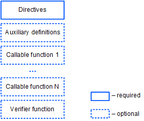

# dApp-скрипт

dApp-скрипт позволяет определять вызываемые (сallable) функции, которые могут быть вызваны с других аккаунтов путем отправки транзакции вызова скрипта и выполнять различные действия на блокчейне. Кроме того, dApp-скрипт может содержать [функцию-верификатор](/ru/ride/functions/verifier-function), которая разрешает или отклоняет транзакции и ордера, отправляемые аккаунтом.

Аккаунт с прикрепленным к нему dApp-скриптом часто называется просто dApp. О том, как работает dApp, читайте в разделе [Что такое dApp](/ru/building-apps/smart-contracts/what-is-a-dapp); о том, как создать dApp — в разделе [Создание и запуск dApp](/ru/building-apps/smart-contracts/writing-dapp).

## Формат скрипта dApp



### Директивы

dApp-скрипт начинается с [директив](/ru/ride/script/directives):

```ride
{-# STDLIB_VERSION 4 #-}
{-# CONTENT_TYPE DAPP #-}
{-# SCRIPT_TYPE ACCOUNT #-}
```

Приведенные директивы сообщают компилятору, что:

- в скрипте используется Стандартная библиотека версии 4;
- скрипт содержит набор определений;
- скрипт будет привязан к аккаунту (а не к ассету).

### Вспомогательные определения

После директив можно определить вспомогательные переменные и функции, которые будут доступны в пределах всего dApp. Обратите внимание: функции без [аннотаций](/ru/ride/functions/annotations) не могут быть вызваны извне.

Пример определений:

```scala
let someConstant = 42
func doSomething() = {
    height + someConstant
}
```

### Вызываемые функции

Вызываемая функция может быть вызвана с другого аккаунта при помощи транзакции вызова скрипта.

Вызываемая функция помечается аннотацией `@Callable(i)`, где `i` — структура [Invocation](/ru/ride/structures/common-structures/invocation), которая содержит поля транзакции вызова скрипта, доступные вызываемой функции. Имя переменной в аннотации обязательно, даже если вызываемая функция ее не использует.

Результат выполнения вызываемой функции — набор [действий скрипта](/ru/ride/structures/script-actions/), которые будут выполнены на блокчейне: добавление/удаление/изменение записей в хранилище данных аккаунта, выпуск/довыпуск/сжигание/перевод токена и др. Формат результата и доступные действия зависят от версии Стандартной библиотеки.

Подробное описание вызываемых функций приведено в разделе [Вызываемая функция](/ru/ride/functions/callable-function).

Ниже приведен пример вызываемой функции, которая переводит вызвавшему ее аккаунту 1 WAVES и записывает информацию об этом в хранилище данных аккаунта. Если тот же аккаунт снова пытается вызвать функцию, она не делает ничего.

```ride
@Callable(i)
func faucet () = {
    let isKnownCaller =  match getBoolean(this, toBase58String(i.caller.bytes)) {
        case hist: Boolean =>
            hist
        case _ =>
            false
    }
    if (!isKnownCaller) then 
        ScriptResult(
           WriteSet([DataEntry(toBase58String(i.caller.bytes), true)]),
           TransferSet([ScriptTransfer(i.caller, 100000000, unit)])
        )
    else WriteSet([])
}
```

### Функция-верификатор

Функция-верификатор проверяет транзакции и ордера, отправляемые от имени аккаунта dApp, на соответствие заданным условиям (то есть работает аналогично скрипту аккаунта).

Функция-верификатор помечается аннотацией `@Verifier(tx)`, где `tx: Transaction|Order` — текущая проверяемая транзакция или ордер.  Имя переменной в аннотации обязательно, даже если вызываемая функция ее не использует.

Функция-верификатор не имеет аргументов.

Возможными результатами выполнения функции являются:

- `true` (отправка разрешена),
- `false` (отправка запрещена),
- ошибка (отправка запрещена).

Подробное описание приведено в разделе [Функция-верификатор](/ru/ride/functions/verifier-function).

Ниже приведен пример функции-верификатора, которая разрешает только [транзакции перевода](/ru/blockchain/transaction-type/transfer-transaction): отправка транзакций другого типа и ордеров запрещена. С помощью оператора [match ... case](/ru/ride/operators/match-case) можно настроить разные условия в зависимости от типа транзакции/ордера.

```ride
@Verifier(tx)
func verify() = {
    match tx {
        case ttx:TransferTransaction => sigVerify(ttx.bodyBytes, ttx.proofs[0], ttx.senderPublicKey)
        case _ => false
    }
}
```

Если в dApp нет функции верификации, то выполняется верификация по умолчанию, то есть проверка, что транзакция или ордер действительно подписаны этим аккаунтом.

## Неуспешные транзакции

Если скрипт ассета отклонил [транзакцию вызова скрипта](](/ru/blockchain/transaction-type/invoke-script-transaction)) (при условии что она прошла проверку подписи отправителя или проверку скриптом аккаунта, а сложность вычислений, выполненных dApp-скриптом, превысила [порог для сохранения неуспешных транзакций](/ru/ride/limits/)), она сохраняется на блокчейне с атрибутом `"applicationStatus": "script_execution_failed"`. С отправителя транзакции взимается комиссия. Других изменений не блокчейне транзакция не влечет.

[Подробнее о валидации транзакций](/ru/blockchain/transaction/transaction-validation)
[Подробнее о работе с неуспешными транзакциями](/ru/keep-in-touch/april)


## Данные, доступные dApp-скрипту

* [Данные, доступные вызываемой функции]()
* [Данные, доступные функции-верификатору]()

## Примеры

Примеры dApp-скриптов можно найти:

* В разделе [Практические руководства](/ru/building-apps/how-to#dapps).
* В [Waves IDE](https://waves-ide.com/) в меню **Library→ dApps**.
* На Github в репозитории [ride-examples](https://github.com/wavesplatform/ride-examples/blob/master/welcome.md).
